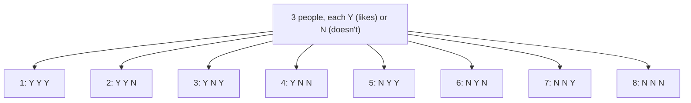

# Session — Bernoulli, Binomial & The Central Limit Theorem

## 1. Bernoulli Distribution

### What is it?
Models a **binary outcome** — success (1) or failure (0). Named after Jacob Bernoulli (17th century).

- Characterized by a **single parameter**: `p` = probability of success
- `1 − p` = probability of failure

### PMF Formula
```
P(X = x) = pˣ (1−p)¹⁻ˣ         where x ∈ {0, 1}
```

**How to use it — step by step:**
*Example: A fair coin toss (Heads = success = 1, Tails = failure = 0), p = 0.5*
1. P(X=1) = p¹(1−p)⁰ = (0.5)¹ × (0.5)⁰ = 0.5 × 1 = **0.5**
2. P(X=0) = p⁰(1−p)¹ = (0.5)⁰ × (0.5)¹ = 1 × 0.5 = **0.5**

**Visualizing the PMF for three different `p` values:**
```
p = 0.2                     p = 0.5                     p = 0.8
P(X=0) ██████████████ 0.8   P(X=0) ███████ 0.5          P(X=0) ███ 0.2
P(X=1) ███ 0.2               P(X=1) ███████ 0.5          P(X=1) ██████████████ 0.8
```

### Use in Machine Learning
Used to model binary outcomes: will a customer purchase or not, is an email spam or not, does a patient have a disease or not.

---

## 2. Binomial Distribution

### What is it?
Models the **number of successes in a fixed number of independent Bernoulli trials** (each with the same success probability `p`).

- Two parameters: `n` (number of trials), `p` (probability of success per trial)
- Notation: `X ~ Binomial(n, p)`
- Special case: `n = 1` → reduces to a **Bernoulli distribution**

### The 4 Criteria for a Binomial Setting
1. The process consists of `n` trials
2. Only 2 outcomes are possible per trial (success/failure)
3. P(success) = p, P(failure) = 1−p, and this stays **fixed** every trial
4. The trials are **independent**

### PMF Formula
```
P(X = x) = ⁿCₓ · pˣ · (1−p)ⁿ⁻ˣ
```
where:
- `n` = number of trials
- `p` = probability of success
- `x` = desired number of successes
- `ⁿCₓ` = "n choose x" = n! / (x!(n−x)!) — the number of ways to arrange x successes among n trials

### Worked Example — Step by Step
*"The probability of anyone watching this lecture in the future and liking it is 0.5 (n=3 people, p=0.5). What is the probability that exactly 2 out of 3 people will like it?"*

1. Identify values: n = 3, p = 0.5, x = 2
2. Compute ⁿCₓ = ³C₂ = 3! / (2!×1!) = **3**
3. Compute pˣ = (0.5)² = 0.25
4. Compute (1−p)ⁿ⁻ˣ = (0.5)¹ = 0.5
5. Multiply all together: 3 × 0.25 × 0.5 = **0.375 = 3/8**

**All 4 possible outcomes for n=3, p=0.5 (visualized as a tree):**


Since each of the 8 equally-likely outcomes has probability 1/8:
| # who like it | Outcomes matching | Probability |
|---|---|---|
| 0 out of 3 | NNN | 1/8 |
| 1 out of 3 | YNN, NYN, NNY | 3/8 |
| 2 out of 3 | YYN, YNY, NYY | 3/8 |
| 3 out of 3 | YYY | 1/8 |

**Binomial shape as `p` increases (conceptual sketch, n=100 trials):**
```
p = 0.2 (peak near 20)          p = 0.5 (peak near 50)          p = 0.9 (peak near 90)
        ▄█▄                              ▄█▄                             ▄█▄
      ▄████▄                          ▄██████▄                        ▄██████▄
   ▄▄████████▄▄                    ▄▄████████████▄▄                ▄▄████████▄▄
0  10  20  30  40   ...       0  20  40  60  80  100  ...     0 ...  70  80  90  100
```
As `p` increases, the peak of the distribution shifts to the right (toward more successes).

### Use Cases
1. **Binary classification** — e.g., spam vs not-spam detection
2. **Hypothesis testing** — probability of observing k successes under a null hypothesis
3. **Logistic regression** — models the probability of a binary event
4. **A/B testing** — comparing conversion rates between two groups

---

## 3. Sampling Distribution

### What is it?
A probability distribution describing the statistical properties (e.g., mean, proportion) of a **sample statistic**, computed from **multiple independent samples** of the same size drawn from a population.

### Why It Matters
Lets us **estimate the variability** of a sample statistic — essential for computing confidence intervals, performing hypothesis tests, and making predictions about the population from sample data.

---

## 4. Central Limit Theorem (CLT)

### Statement
> The distribution of the **sample means** of a large number of independent, identically distributed random variables will approach a **Normal distribution** — regardless of the shape of the original (underlying) distribution.

### Conditions for CLT to Hold
1. Sample size is large enough (typically **n ≥ 30**)
2. Sample is drawn from a finite population, or an infinite population with **finite variance**
3. Random variables in the sample are **independent and identically distributed (i.i.d.)**

### Visualizing the CLT — Step by Step
```
Original population (could be ANY shape — skewed, uniform, bimodal...)

   Right-skewed:  ▁▂▄█▇▅▃▂▁___________
                  (long tail to the right)

Now repeatedly draw samples of size n≥30, and calculate each sample's mean:

   Sample 1 (n=30) → mean₁
   Sample 2 (n=30) → mean₂
   Sample 3 (n=30) → mean₃
   ...
   Sample 1000 (n=30) → mean₁₀₀₀

Plot all these sample means together:

   Distribution of sample means:   ▁▃▆█▆▃▁
                                   (bell-shaped — Normal! Even though
                                    the ORIGINAL data was skewed)
```

**Why This Is Powerful:** No matter what the original population looks like, the sampling distribution of the mean becomes approximately Normal — which lets us use all the well-understood tools of the Normal distribution (Z-scores, confidence intervals, hypothesis tests) on the sample mean.

### Why CLT Matters in Data Science
- Provides theoretical justification for **t-tests, ANOVA, linear regression**
- Lets us build **confidence intervals** and run **hypothesis tests** on a population using only sample data
- Foundation of most classical inferential statistics

---

## 5. Case Study — Estimating Average Income Using CLT

**Goal:** Estimate the average income of an entire population (e.g., "average salary of all Indians") using only sample data.

### Step-by-Step Process
1. **Collect multiple random samples** of salaries from a representative group (each sample size n > 30, to satisfy CLT). Ensure samples are unbiased and representative.
2. **Calculate the sample mean and sample standard deviation** for each individual sample.
3. **Average all the sample means together** → this becomes your best estimate of the true population mean.
4. **Calculate the Standard Error (SE)** of the sample means:
   ```
   SE = (standard deviation of the sample means) / √(number of samples)
   ```
5. **Build a 95% Confidence Interval:**
   ```
   lower_limit = average_sample_means − 1.96 × SE
   upper_limit = average_sample_means + 1.96 × SE
   ```
6. **Report** the estimated average income along with the confidence interval range.

**How to read the result:** If you get a confidence interval of, say, ₹45,000 to ₹52,000, this means: *"We are 95% confident that the true average income of the entire population falls somewhere between ₹45,000 and ₹52,000."*

> **Important caveat:** The accuracy of this entire process depends heavily on the **quality and representativeness** of your samples. Biased or unrepresentative samples will produce a misleading confidence interval, no matter how correctly you apply the CLT math.

### Quick Python Reference
```python
import numpy as np

# Simulate drawing many samples and computing their means
population = np.random.exponential(scale=50000, size=100000)  # skewed income data

sample_means = []
for _ in range(1000):
    sample = np.random.choice(population, size=40, replace=False)
    sample_means.append(sample.mean())

sample_means = np.array(sample_means)

avg_of_means = sample_means.mean()
se = sample_means.std() / np.sqrt(len(sample_means))

lower = avg_of_means - 1.96 * se
upper = avg_of_means + 1.96 * se

print(f"Estimated mean: {avg_of_means:.2f}")
print(f"95% CI: [{lower:.2f}, {upper:.2f}]")
```

---

## Additional Notes (Beyond the Session Content)

### Bernoulli vs Binomial — Quick Comparison
| | Bernoulli | Binomial |
|---|---|---|
| Number of trials | 1 | n (multiple) |
| What it models | Single yes/no outcome | Count of successes across n trials |
| Parameters | p | n, p |
| Relationship | Binomial with n=1 = Bernoulli | Binomial = sum of n independent Bernoullis |

### Why n ≥ 30 for CLT?
This is a widely used **rule of thumb**, not a strict law — for populations that are already close to Normal, even smaller samples (n < 30) work fine. For heavily skewed populations, you may need a larger n for the sampling distribution of the mean to look sufficiently Normal.

### Why This Matters for Data Science
- The CLT is the reason **A/B testing** works — we can compare sample means between two groups and trust that the sampling distribution is approximately Normal, even if user behavior data itself is skewed
- Confidence intervals (built using CLT) are everywhere in reporting business metrics: "average revenue per user is $50 ± $2 at 95% confidence"
- Binomial thinking underlies **click-through rate modeling**, **conversion rate testing**, and basic classification probability estimates
