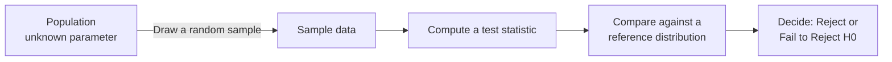
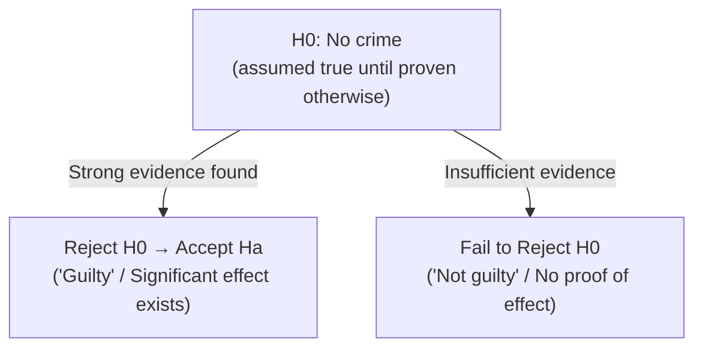
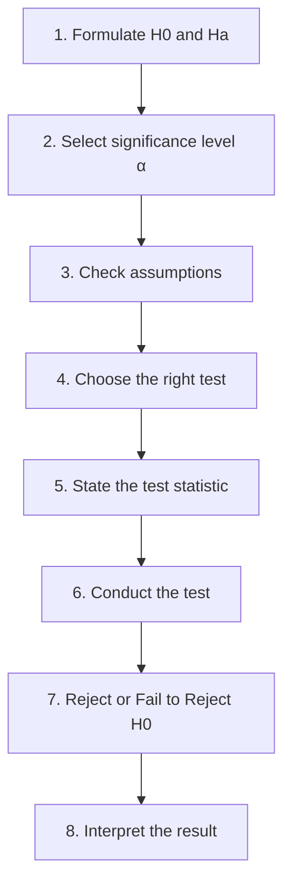
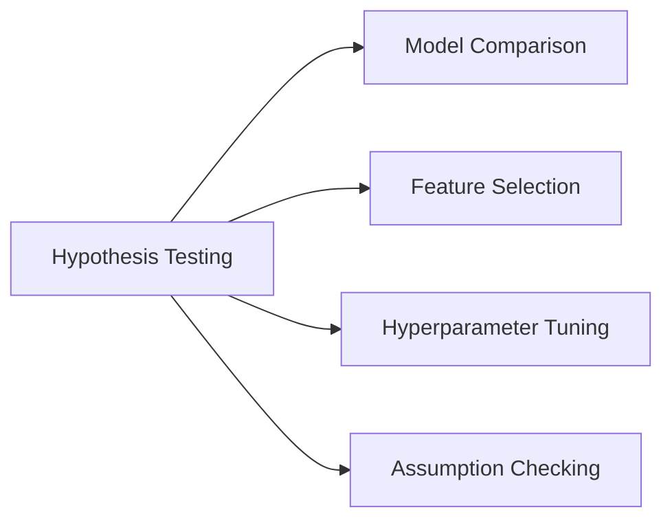

# Session 1 — Hypothesis Testing (Fundamentals & Z-Test)

## Table of Contents

1. [What is Hypothesis Testing?](#what-is-hypothesis-testing)
2. [Null and Alternate Hypothesis](#null-and-alternate-hypothesis)
3. [Steps Involved in Hypothesis Testing](#steps-involved-in-hypothesis-testing)
4. [Performing a Z-Test](#performing-a-z-test)
5. [Rejection Region Approach](#rejection-region-approach)
6. [Type 1 vs Type 2 Error](#type-1-vs-type-2-error)
7. [One-Sided vs Two-Sided Test](#one-sided-vs-two-sided-test)
8. [Where Can Hypothesis Testing Be Applied?](#where-can-hypothesis-testing-be-applied)
9. [Hypothesis Testing — ML Applications](#hypothesis-testing--ml-applications)
10. [Additional Notes (Beyond the Session Content)](#additional-notes-beyond-the-session-content)

---

## What is Hypothesis Testing?

A **statistical hypothesis test** is a method of statistical inference used to decide whether the data at hand sufficiently support a particular hypothesis. Hypothesis testing allows us to make **probabilistic statements about population parameters** using only a sample of data — we almost never get to measure an entire population, so we use a sample to make an educated, quantified guess about the whole.



---

## Null and Alternate Hypothesis

**1. Null Hypothesis (H0):**
The null hypothesis is a statement that assumes there is **no significant effect or relationship** between the variables being studied. It is the "status quo" — the default assumption of no effect until proven otherwise. Hypothesis testing gathers evidence (data) to either **reject** or **fail to reject** H0 in favor of the alternative hypothesis.

**2. Alternative Hypothesis (H1 or Ha):**
The alternative hypothesis contradicts the null hypothesis, claiming there **is** a significant effect or relationship. It represents what the researcher is actually trying to demonstrate.

**Important points:**
- How do you decide what is H0 and what is Ha? Typically, **the null hypothesis says "nothing new is happening."**
- We try to gather evidence to **reject** the null hypothesis — we never "prove" it.
- Failing to reject H0 does **not** mean H0 is true — it just means there wasn't enough evidence to support Ha.

**Courtroom analogy:** Hypothesis tests are similar to jury trials. H0 is like the "not guilty" verdict, and Ha is the "guilty" verdict. The defendant is assumed not guilty (H0) unless the prosecution proves guilt "beyond a reasonable doubt" (statistically significant evidence). If the jury is convinced, they reject H0 (not guilty) in favor of Ha (guilty).



### How to use it — step by step
There's no formula here, but here's the beginner workflow for **stating** hypotheses using a numeric example:

**Example:** A company wants to test if a new training program *increases* average employee productivity, currently at 50 units/day.

1. Ask: "What is the default, no-change assumption?" → Productivity stays at 50 units/day.
2. That default becomes **H0: μ = 50**
3. Ask: "What is the researcher trying to show?" → Productivity has increased.
4. That becomes **Ha: μ > 50** (a one-sided/directional claim, since we only care about an increase)

---

## Steps Involved in Hypothesis Testing

**Rejection Region Approach — full workflow:**

1. Formulate a Null and Alternate hypothesis.
2. Select a significance level (the probability of rejecting H0 when it's actually true — usually 0.05 or 0.01).
3. Check assumptions (e.g., is the underlying distribution roughly normal?).
4. Decide which test is appropriate (Z-test, T-test, Chi-square test, ANOVA, etc.).
5. State the relevant test statistic.
6. Conduct the test (compute the statistic from your sample).
7. Reject or fail to reject the Null Hypothesis.
8. Interpret the result in plain language.



### How to use it — step by step
See the fully worked examples in [Performing a Z-Test](#performing-a-z-test) below — they walk through all 8 steps end to end with real numbers.

---

## Performing a Z-Test

A **Z-test** is used to test a claim about a population mean **when the population standard deviation (σ) is known** (and/or the sample size is large, n ≥ 30).

**Formula:**

```
        x̄ − μ
Z  =  ──────────
        σ / √n
```

Where:
- `x̄` = sample mean
- `μ` = hypothesized population mean (from H0)
- `σ` = population standard deviation (known)
- `n` = sample size

The 95% confidence idea shown in the notes: `95% sure = (1 − α)`, i.e., if α = 0.05, we are 95% confident in our decision region.

### How to use it — step by step (Worked Example 1 — Training Program)

**Scenario:** A company's average employee productivity was 50 units/day (known population std dev σ = 5). After a training program, a random sample of n = 30 employees has a mean of 53 units/day. Did the training program significantly increase productivity?

1. **State hypotheses:**
   - H0: μ = 50 (no change)
   - Ha: μ > 50 (one-sided — testing for an *increase*)
2. **Significance level:** α = 0.05
3. **Check assumptions:** σ is known, n = 30 is reasonably large → Z-test is appropriate.
4. **Compute the test statistic:**
   ```
   Z = (53 − 50) / (5 / √30)
     = 3 / (5 / 5.477)
     = 3 / 0.913
     = 3.29
   ```
5. **Compare to critical value:** For a one-tailed test at α = 0.05, critical Z = 1.645.
6. **Decision:** Since 3.29 > 1.645, we **reject H0**.
7. **Interpret:** There is strong statistical evidence that the training program increased productivity.

```
Standard Normal Curve — One-tailed (right) rejection region, α = 0.05

Probability
   |                    ___
   |                 __/   \__
   |               _/         \_
   |             _/             \_
   |           _/                 \_
   |         _/                     \___
   |       _/                            \________
   |_____/_________________|______________________\_____ Z
        -3      -1.645      0         1.645  ↑      3
                            |          |     Z=3.29 (observed)
                            |__________|///////////////|
                              Fail to        Reject
                              Reject H0      H0 region
```

### How to use it — step by step (Worked Example 2 — Lays Wafer Weight, σ known = 4g)

**Scenario:** A snack company claims Lays wafer packets average 50 grams. A watchdog samples n = 40 packets, finds a sample mean of 49 grams, with a **known** population std dev σ = 4 grams. Does the actual average differ significantly from 50g?

1. **Hypotheses:**
   - H0: μ = 50
   - Ha: μ ≠ 50 (two-sided — testing for *any* difference, not just higher or lower)
2. **α = 0.05**
3. **Assumptions met:** σ known, n = 40 is large.
4. **Test statistic:**
   ```
   Z = (49 − 50) / (4 / √40)
     = −1 / (4 / 6.325)
     = −1 / 0.632
     = −1.58
   ```
5. **Critical values for two-tailed test at α = 0.05:** ±1.96
6. **Decision:** |−1.58| = 1.58 < 1.96 → **fail to reject H0**.
7. **Interpret:** There isn't enough evidence to say the actual average weight differs from the claimed 50 grams.

```
Standard Normal Curve — Two-tailed rejection regions, α = 0.05

Probability
   |                    ___
   |                 __/   \__
   |               _/         \_
   |             _/             \_
   |    ///// _/                 \_ /////
   |____///_/_____________________\_\///_____ Z
        -1.96         0          1.96
         ↑
      Z=-1.58 (observed, inside "fail to reject" zone)

Legend: ///// = Reject H0 region (each tail = α/2 = 0.025)
```

---

## Rejection Region Approach

**Significance level (α):** A predetermined threshold used in hypothesis testing to decide whether H0 should be rejected. It represents the probability of rejecting H0 when it's actually true — also called **Type I error**.

**Critical region:** The region of values that corresponds to rejecting H0 at a chosen probability level.

```
Two-tailed Rejection Region at α = 0.05 (Z-distribution)

           Fail to Reject H0
                (95%)
        ___________________________
       /                           \
      /                             \
_____/                               \_____
 REJECT|                             |REJECT
 (2.5%)|                             |(2.5%)
      -1.96                        +1.96
   Critical Value              Critical Value
      (−)                          (+)
```

**Problem with the Rejection Region Approach:** It only tells you "reject" or "fail to reject" at one fixed α — it doesn't tell you **how strong** the evidence is. Two very different Z-scores (say Z = 1.97 and Z = 15) both just get labeled "reject H0" even though Z = 15 is enormously more extreme. This limitation is what motivates using the p-value approach instead of (or alongside) the rejection region approach — a p-value gives a continuous measure of evidence strength rather than a binary reject/fail-to-reject flag.

### How to use it — step by step
There's no separate formula here (it reuses the Z statistic from above) — but the workflow is:
1. Pick α (e.g., 0.05).
2. Look up the critical value(s) for your test type (one-tailed or two-tailed) from the Z table.
3. Compute your test statistic.
4. If the test statistic falls in the "reject" zone (beyond the critical value), reject H0; otherwise, fail to reject.

---

## Type 1 vs Type 2 Error

There are two types of errors that can occur when deciding about the null hypothesis:

- **Type-I error (False Positive):** Occurs when the sample results lead to rejecting H0 when it is **actually true**. In other words, finding a "significant" effect that doesn't really exist. The probability of committing a Type I error is denoted **α (alpha)** — the significance level. By choosing α, researchers control the risk of Type I error.
- **Type-II error (False Negative):** Occurs when H0 is **not rejected** when it is actually **false**. This means failing to detect a real effect. The probability of committing a Type II error is denoted **β (beta)**.
- **Power of a test = 1 − β**: the probability of correctly rejecting a false H0.

|                     | H0 True                | H0 False               |
|---------------------|------------------------|-------------------------|
| **Reject H0**       | Type I error (α)       | Correct decision         |
| **Fail to Reject H0** | Correct decision      | Type II error (β)       |

**Trade-off:** Lowering α (fewer false positives) increases β (more false negatives), and vice versa — you cannot minimize both simultaneously without increasing sample size.

```
Trade-off Illustration (α = 0.05 shown as red tails)

          2.5%                              2.5%
        (Type I)      95% "no effect" zone   (Type I)
       ////////  ______________________  ////////
      /////// _/                        \_ ///////
     ////// _/                            \_ //////
    _____ _/                                \_ _____
         -2σ                                 +2σ
```

### How to use it — step by step
1. Decide your tolerance for false positives → set **α** (commonly 0.05 or 0.01).
2. Recognize that a smaller α reduces Type I error risk but raises Type II error (β) risk for the same sample size.
3. To reduce **both** errors simultaneously, increase your sample size `n` (this tightens the sampling distribution, making both types of error less likely at the same α).

**Numeric example:** If α = 0.05, you accept a 5% chance of a Type I error (wrongly rejecting a true H0) in every single test you run. If you ran 100 independent tests where H0 was actually always true, you'd expect about 5 of them to incorrectly show "significant" results just by chance.

---

## One-Sided vs Two-Sided Test

**One-sided (one-tailed) test:** Used when the researcher is interested in the effect in a **specific direction** (greater than OR less than). Ha contains an inequality (`>` or `<`).
> Example: Does a new medication *increase* the average recovery rate?

**Two-sided (two-tailed) test:** Used when the researcher is interested in the effect in **both directions**. Ha contains a "not equal to" (`≠`).
> Example: Does a new medication have a *different* (higher or lower) average recovery rate?

```
Right-tail test              Left-tail test               Two-tail test
Ha: μ > value                Ha: μ < value                Ha: μ ≠ value

        ___                      ___                          ___
     __/   \__                __/   \__                    __/   \__
   _/         \_             /         \_                _/         \_
 _/             \___       _/            \___          _/             \___
/________|////|_____     /////|________|_____        //|________|//|_____
        0    critical         critical   0            crit    0    crit
             value(→)         value(←)                 (−)         (+)
```

**Two-tailed test — Advantages:**
1. Detects effects in **both** directions — useful when the direction of the true effect is uncertain.
2. More conservative — α is split between both tails, reducing Type I error risk when direction is uncertain.

**Two-tailed test — Disadvantages:**
1. Less powerful — since α is divided across both tails, a **larger effect size** is needed to reject H0, raising Type II error risk.
2. Not ideal when the hypothesis is genuinely directional.

**One-tailed test — Advantages:**
1. More powerful — the entire α is allocated to one tail, making it easier to detect a real effect in that direction.
2. Appropriate when there's a strong theoretical/practical reason to expect a directional effect.

**One-tailed test — Disadvantages:**
1. Misses effects in the opposite direction — if the true effect is actually reversed, the test can't detect it.
2. Increased risk of Type I error if the true effect is actually in the untested direction.

### How to use it — step by step
1. Ask: "Do I only care if the value went up (or only down), or do I care about *any* difference?"
2. **Only one direction matters** → one-tailed test → put the entire α (e.g., all 5%) in one tail → critical Z = 1.645 (for α = 0.05).
3. **Either direction matters** → two-tailed test → split α across both tails (2.5% each side) → critical Z = ±1.96 (for α = 0.05).

**Numeric example:** Testing whether a chocolate bar weighs *less than* the claimed 100g (a one-sided concern for a consumer complaint) uses Ha: μ < 100 with critical Z = −1.645. Testing whether it's simply *different* from 100g (a quality-control audit) uses Ha: μ ≠ 100 with critical Z = ±1.96.

---

## Where Can Hypothesis Testing Be Applied?

1. **Testing effectiveness of interventions/treatments** — e.g., does a new drug, therapy, or educational program have a significant effect vs. a control group?
2. **Comparing means or proportions** — e.g., comparing average customer satisfaction, conversion rates, or employee performance across groups.
3. **Analysing relationships between variables** — e.g., correlation between age and income, or advertising spend and sales.
4. **Evaluating goodness of fit** — e.g., does a theoretical distribution (normal, binomial, Poisson) fit the observed data well?
5. **Testing independence of categorical variables** — e.g., is there a relationship between product type and return likelihood?
6. **A/B testing** — comparing two versions (A and B) of a product/webpage/ad to see which performs better.

---

## Hypothesis Testing — ML Applications

1. **Model comparison** — e.g., a paired t-test comparing accuracy/error rate of two models across multiple cross-validation folds, to see if one is significantly better.
2. **Feature selection** — using t-tests, chi-square tests, or ANOVA to check which features are significantly related to the target variable.
3. **Hyperparameter tuning** — comparing model performance across different hyperparameter settings to see if differences are statistically meaningful (not just noise).
4. **Assessing model assumptions** — e.g., checking normality of residuals in linear regression using hypothesis tests.



---

## Additional Notes (Beyond the Session Content)

These extra notes weren't in the original material but are useful context for practical data-science work.

### Related concepts worth knowing

- **P-value:** A more nuanced alternative/companion to the rejection-region approach — instead of a binary reject/fail-to-reject flag, it gives a continuous measure of how much evidence the data provides against H0. (Covered in depth in the Session 2 notes.)
- **T-test:** When the population standard deviation is unknown (the more common real-world scenario), you use a t-test instead of a Z-test. (Also covered in Session 2.)
- **Confidence Intervals:** A range of plausible values for a population parameter, closely linked to hypothesis testing — if a (1−α) confidence interval for μ doesn't contain the H0 value, you'd reject H0 at that same α.
- **Effect size (e.g., Cohen's d):** A hypothesis test tells you *whether* an effect is statistically significant, but not *how big* it is practically. Effect size measures the magnitude of the difference, independent of sample size.
- **Multiple testing / p-hacking:** Running many hypothesis tests increases the chance of a false positive purely by chance (the "family-wise error rate" problem). Corrections like **Bonferroni** or **Benjamini-Hochberg (FDR)** adjust for this.
- **Chi-square test:** Tests relationships between categorical variables (independence test) or goodness of fit to a theoretical distribution — complements the Z-test's focus on numeric means.
- **ANOVA (Analysis of Variance):** Extends the two-sample comparison idea to **3+ groups** at once, testing whether at least one group mean differs from the others, without inflating Type I error the way running many pairwise tests would.

### Common ML / data-science use cases

- **A/B testing in product analytics** — comparing conversion rates or click-through rates between a control and treatment group (often using a two-proportion Z-test or a chi-square test, since the outcome is binary).
- **Feature significance in regression** — the p-values reported next to each coefficient in `statsmodels` OLS output are literally hypothesis tests of H0: coefficient = 0.
- **Drift detection** — testing whether a new batch of production data has a significantly different mean than the training data (a form of Z/one-sample testing used in MLOps monitoring).
- **Randomized controlled experiments** — evaluating whether a new UI, pricing, or algorithm change causes a statistically significant shift in a business metric.

### Quick Python Reference

```python
import numpy as np
from scipy import stats
import matplotlib.pyplot as plt

# ---------------------------------------------------------
# One-sample Z-test (population std known)
# ---------------------------------------------------------
def one_sample_z_test(sample_mean, pop_mean, pop_std, n, alternative="two-sided"):
    z = (sample_mean - pop_mean) / (pop_std / np.sqrt(n))
    if alternative == "two-sided":
        p_value = 2 * (1 - stats.norm.cdf(abs(z)))
    elif alternative == "greater":
        p_value = 1 - stats.norm.cdf(z)
    else:  # "less"
        p_value = stats.norm.cdf(z)
    return z, p_value

# Example 1: training program (one-sided, testing for an increase)
z_stat, p_val = one_sample_z_test(sample_mean=53, pop_mean=50, pop_std=5, n=30, alternative="greater")
print(f"Z = {z_stat:.3f}, p-value = {p_val:.5f}")

# Example 2: Lays wafer weight (two-sided, testing for any difference)
z_stat2, p_val2 = one_sample_z_test(sample_mean=49, pop_mean=50, pop_std=4, n=40, alternative="two-sided")
print(f"Z = {z_stat2:.3f}, p-value = {p_val2:.5f}")

# ---------------------------------------------------------
# Visualizing rejection regions
# ---------------------------------------------------------
x = np.linspace(-4, 4, 500)
y = stats.norm.pdf(x)
plt.plot(x, y)
plt.fill_between(x, y, where=(x >= 1.96), color="red", alpha=0.4, label="Reject region (right tail)")
plt.fill_between(x, y, where=(x <= -1.96), color="red", alpha=0.4, label="Reject region (left tail)")
plt.axvline(3.29, color="blue", linestyle="--", label="Observed Z (Example 1)")
plt.legend()
plt.title("Two-tailed rejection regions at α = 0.05")
plt.show()
```
