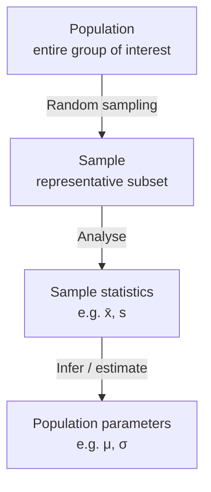
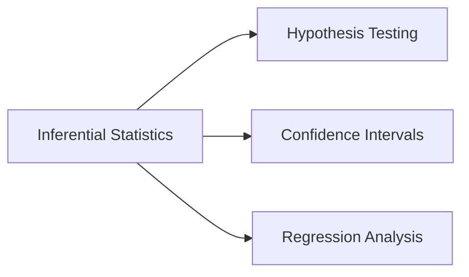
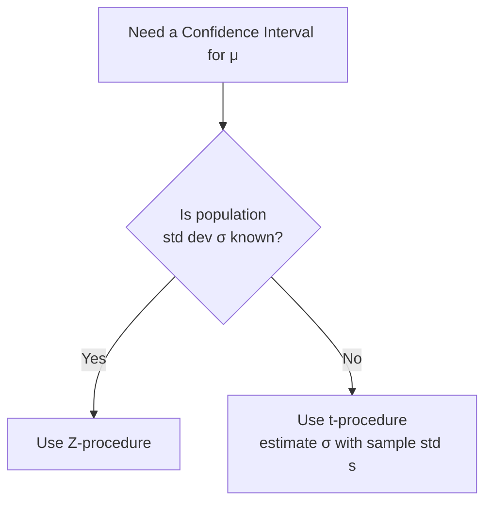

# Session — Confidence Interval

## Table of Contents

1. [Population vs Sample](#population-vs-sample)
2. [Parameter vs Statistic (Estimate)](#parameter-vs-statistic-estimate)
3. [Inferential Statistics](#inferential-statistics)
4. [Point Estimate](#point-estimate)
5. [Confidence Interval](#confidence-interval)
6. [Confidence Interval (Sigma Known) — Z-procedure](#confidence-interval-sigma-known--z-procedure)
7. [Interpreting Confidence Interval](#interpreting-confidence-interval)
8. [Factors Affecting Margin of Error](#factors-affecting-margin-of-error)
9. [Confidence Interval (Sigma Not Known) — t-procedure](#confidence-interval-sigma-not-known--t-procedure)
10. [Student's T-Distribution](#students-t-distribution)
11. [Additional Notes (Beyond the Session Content)](#additional-notes-beyond-the-session-content)

---

## Population vs Sample

**Population:** The entire group or set of individuals, objects, or events that a researcher wants to study or draw conclusions about. It can be people, animals, plants, or even inanimate objects, depending on the context. The population represents the complete set of possible data points.

**Sample:** A subset of the population selected for study — a smaller group intended to be representative of the larger population. Since it's often impractical or impossible to collect data from every member of a population, samples are used as an efficient, cost-effective way to gather information and make inferences about the population.



### How to use it — step by step
There's no formula here, but the practical workflow is:
1. Define your population of interest (e.g., "all customers who bought a product in the last year").
2. Since surveying everyone is impractical, draw a **random sample** (e.g., 200 customers).
3. Compute statistics from that sample (e.g., average satisfaction score).
4. Use those sample statistics to make inferences about the whole population.

---

## Parameter vs Statistic (Estimate)

**Parameter:** A numerical value that describes a characteristic of a **population**. Parameters are usually denoted with Greek letters — e.g., **μ** (mu) for the population mean, **σ** (sigma) for the population standard deviation. Parameters are usually unknown and must be estimated from sample data.

**Statistic:** A numerical value that describes a characteristic of a **sample**. Common statistics include the sample mean (**x̄**, "x-bar"), the sample median, and the sample standard deviation (**s**). Statistics are used to make inferences about the corresponding unknown population parameter.

| | Population | Sample |
|---|---|---|
| Mean | μ (parameter, usually unknown) | x̄ (statistic, computed from data) |
| Standard deviation | σ (parameter, usually unknown) | s (statistic, computed from data) |

### How to use it — step by step
**Numeric example:** Suppose you want to know the true average height of all adults in a city (population parameter μ — unknown, since you can't measure everyone). You measure a random sample of 50 people and get a sample mean height x̄ = 168 cm and sample standard deviation s = 7 cm. Here, x̄ = 168 cm and s = 7 cm are your **statistics**, and you'll use them to estimate the unknown **parameters** μ and σ.

---

## Inferential Statistics

**Inferential statistics** is a branch of statistics that focuses on making predictions, estimations, or generalizations about a larger population based on a sample of data. It uses probability theory to draw conclusions about population characteristics by analysing a smaller subset.

The key idea: since it's often impractical or impossible to collect data from every member of a population, we use a representative sample to make inferences about the entire group. Inferential techniques include **hypothesis testing**, **confidence intervals**, and **regression analysis**, among others.

These methods help answer questions like:
1. Is there a significant difference between two groups?
2. Can we predict the outcome of a variable based on the values of other variables?
3. What is the relationship between two or more variables?

Inferential statistics is widely used in economics, social sciences, medicine, and natural sciences to make informed decisions and guide policy based on limited data.



---

## Point Estimate

A **point estimate** is a single value, calculated from a sample, that serves as the best guess or approximation for an unknown population parameter, such as the mean or standard deviation.

### How to use it — step by step
**Numeric example:** You sample 50 adults from a city and find their average height is x̄ = 168 cm. This single number, **168 cm**, is your point estimate for the true (unknown) population mean height μ. Note that a point estimate gives no sense of how confident you should be in it — that's exactly the gap a **confidence interval** fills (see next section).

---

## Confidence Interval

**Confidence interval**, in simple words, is a **range of values** within which we expect a particular population parameter, like a mean, to fall. It's a way to express the uncertainty around an estimate obtained from sample data.

**Confidence level:** Usually expressed as a percentage (like 95%), it indicates how sure we are that the true value lies within the interval.

**Formula:**

```
Confidence Interval  =  Point Estimate  ±  Margin of Error
```

**Important note:** A confidence interval is created for **parameters**, not statistics. Statistics (like x̄) help us construct the confidence interval for the corresponding parameter (like μ).

**Ways to calculate a CI:**
- **Z-procedure** — used when the population standard deviation (σ) is **known**.
- **t-procedure** — used when the population standard deviation (σ) is **unknown** (more common in practice).



### How to use it — step by step
**Numeric example (conceptual):** Suppose a point estimate for average delivery time is 25 minutes, and after calculating the margin of error, you get a 95% confidence interval of **[21, 29] minutes** (i.e., 25 ± 4). You would say: *"We are 95% confident that the true average delivery time for the population lies between 21 and 29 minutes."* The exact calculation of that "± 4" margin of error is shown step by step in the next two sections (Z-procedure and t-procedure).

**Examples of real-world CI usage (from the session):** error bars on bar plots (e.g., a Seaborn bar plot of average fare by passenger class, with error bars showing the confidence interval around each average) and shaded confidence bands around line plots (e.g., a neuroscience signal plot showing average brain signal over time, with a shaded region around each line representing the CI of the mean at each time point).

---

## Confidence Interval (Sigma Known) — Z-procedure

**Assumptions:**
1. **Random sampling** — the data must be collected using a random sampling method so the sample is representative of the population, minimizing bias.
2. **Known population standard deviation** — σ must be known or accurately estimated. (In practice this is often unknown, but if the sample is large enough, the sample standard deviation s can serve as a reasonable approximation.)
3. **Normal distribution or large sample size** — the Z-procedure assumes the underlying population is normally distributed. If not, the **Central Limit Theorem (CLT)** allows the Z-procedure to still work when the sample size is large (typically **n ≥ 30**), since the sampling distribution of the sample mean approaches normal regardless of the population's shape.

**Formula — a (1 − α)×100% Confidence Interval for μ:**

```
                    σ
CI  =  x̄  ±  Z(α/2) ──
                    √n
```

Where:
- `x̄` = sample mean (point estimate)
- `Z(α/2)` = critical Z-value for the chosen confidence level (e.g., 1.96 for 95%)
- `σ` = population standard deviation (known)
- `n` = sample size
- `Z(α/2) × σ/√n` = the **margin of error**

### How to use it — step by step

**Scenario:** You sample n = 24 customers and measure their point estimate (sample mean) as x̄ = 25 (some metric, e.g., minutes), with a known population standard deviation σ = 10. You want a 95% confidence interval for the true population mean μ.

1. **Choose confidence level:** 95% → α = 0.05 → α/2 = 0.025
2. **Find the critical Z-value:** For a 95% CI, Z(0.025) = **1.96** (this leaves 2.5% in each tail of the normal distribution)
3. **Compute the margin of error:**
   ```
   Margin of Error = Z(α/2) × σ/√n
                   = 1.96 × 10/√24
                   = 1.96 × 10/4.899
                   = 1.96 × 2.041
                   = 4.00
   ```
4. **Construct the interval:**
   ```
   CI = x̄ ± Margin of Error
      = 25 ± 4.00
      = [21, 29]
   ```
5. **Interpret:** We are 95% confident that the true population mean lies between **21 and 29**.

```
Standard Normal Curve — 95% Confidence Interval (Z-procedure)

Probability Density
   |                    ___
   |                 __/   \__
   |               _/         \_
   |             _/             \_
   |    2.5%  __/                 \__  2.5%
   |    ///_/                         \_\\\
   |___/////_____________________________\\\\\___ Z
       -3    -1.96          0          1.96    3
             |←────── 95% confident ──────→|
             (this middle 95% region maps back
              to the interval [21, 29] in the
              original units of x̄)
```

---

## Interpreting Confidence Interval

A confidence interval is a range of values within which a population parameter (like the mean) is estimated to lie, with a certain level of confidence. To interpret it correctly:

1. **Confidence level:** Commonly 90%, 95%, or 99%. It represents the probability that the confidence interval **procedure** will contain the true population parameter, if repeated many times. For example, a 95% confidence interval means: if you drew 100 different samples from the population and calculated a CI for each, approximately **95 of those 100 intervals** would contain the true population parameter.
2. **Interval range (width):** A **narrower** interval suggests a more precise estimate; a **wider** interval indicates greater uncertainty. Width depends on sample size, variability in the data, and the desired confidence level.
3. **Interpretation phrasing:** You say, *"I am X% confident that the true population parameter lies within the range (lower limit, upper limit)."* This statement is about the **interval** (and the long-run procedure), not a probability statement about one specific fixed interval containing a fixed parameter.

**The trade-off:** Higher confidence (e.g., 99% instead of 95%) → **wider** interval (less precise). Lower confidence (e.g., 90%) → **narrower** interval (more precise, but less "sure"). You can't simultaneously have very high confidence AND a very narrow interval without increasing your sample size.

```
Confidence level vs interval width (illustrative)

  90% CI:      [-----23-----27-----]   (narrower, less confident)
  95% CI:    [----21-------29------]   (medium)
  99% CI:  [---19-----------31------] (wider, more confident)

  Narrower ◄─────────────────────► Wider
  More precise                    More confident
```

### How to use it — step by step
1. Compute your CI (using the Z-procedure or t-procedure formula above).
2. State it in the correct form: *"We are [confidence level]% confident that [population parameter] lies between [lower] and [upper]."*
3. Remember: 95% confidence does **not** mean "there's a 95% chance the true mean is in this specific interval" — it means the **method** used to construct the interval captures the true mean 95% of the time across repeated sampling.

**Numeric example:** For the Z-procedure example above (CI = [21, 29] at 95% confidence), the correct interpretation is: *"We are 95% confident that the true population mean lies between 21 and 29."*

---

## Factors Affecting Margin of Error

The margin of error is affected by three factors:

1. **Confidence Level (1 − α)** — a higher confidence level requires a larger critical value (Z or t), which **increases** the margin of error (wider interval).
2. **Sample Size (n)** — a larger sample size **decreases** the margin of error (narrower interval), since `√n` is in the denominator.
3. **Population Standard Deviation (σ)** — more variability in the data **increases** the margin of error (wider interval).

**Formula recap:**

```
                    σ
Margin of Error = Z(α/2) ──
                    √n

also:  Margin of Error = (Upper limit − Lower limit) / 2
```

```
Relationship Between Margin of Error and Confidence Level (Z-procedure)

Margin
of Error
   9 |                                                    ___●
   8 |                                              ___●--
   7 |                                        ●●●---           ← e.g. 95% CI
   6 |                                  ●--
   5 |                            ●--
   4 |                      ●--
   3 |                ●--
     |________________________________________________________
      50    60    70    80    90    95   100
                  Confidence Level (%)

As confidence level → 100%, margin of error grows sharply (curve steepens).
```

### How to use it — step by step

**Numeric example:** Using the earlier scenario (σ = 10, x̄ = 25), see how margin of error changes with confidence level, holding n = 24 fixed:

| Confidence Level | Critical Z | Margin of Error = Z × σ/√n | Resulting CI |
|---|---|---|---|
| 80% | 1.28 | 1.28 × 2.041 = 2.61 | [22.39, 27.61] |
| 90% | 1.645 | 1.645 × 2.041 = 3.36 | [21.64, 28.36] |
| 95% | 1.96 | 1.96 × 2.041 = 4.00 | [21.00, 29.00] |
| 99% | 2.576 | 2.576 × 2.041 = 5.26 | [19.74, 30.26] |

Notice: as confidence level increases, the interval gets **wider** (larger margin of error) — exactly the trade-off described above.

---

## Confidence Interval (Sigma Not Known) — t-procedure

In practice, the population standard deviation σ is **usually unknown**, so we estimate it using the sample standard deviation **s**, and use the **t-distribution** instead of the normal (Z) distribution to account for this extra uncertainty.

**Assumptions:**
1. **Random sampling** — the data must be collected using a random sampling method to ensure the sample is representative and minimize bias.
2. **Sample standard deviation used** — since σ is unknown, the sample standard deviation `s` is used as an estimate. The t-distribution is specifically designed to account for the additional uncertainty this introduces.
3. **Approximately normal distribution** — the population should be approximately normally distributed, or the sample size should be large enough for the CLT to apply. If the population is heavily skewed with extreme outliers, non-parametric methods should be considered instead.
4. **Independent observations** — one observation's value shouldn't influence another's. This matters especially for time series or data with inherent dependencies.

**Formula:**

```
                    s
CI  =  x̄  ±  t(α/2, df) ──
                    √n

where df (degrees of freedom) = n − 1
```

This is directly analogous to the Z-procedure formula, but with `s` replacing `σ`, and the **t critical value** (which depends on degrees of freedom) replacing the Z critical value.

```
CI  =  x̄  ±  Z(α/2) σ/√n       ⟷       CI  =  x̄  ±  t(α/2,df) s/√n
      (σ known — Z procedure)              (σ unknown — t procedure)
```

### How to use it — step by step

**Scenario:** You sample n = 20 items and find a sample mean x̄ = 100 and sample standard deviation s = 15 (σ is unknown). You want a 95% confidence interval for the true population mean μ.

1. **Choose confidence level:** 95% → α = 0.05 → α/2 = 0.025
2. **Degrees of freedom:** df = n − 1 = 20 − 1 = 19
3. **Find the critical t-value:** Looking up the t-table for df = 19 at the 0.025 tail → t(0.025, 19) ≈ **2.093** (larger than the Z-value of 1.96, reflecting the extra uncertainty from estimating σ)
4. **Compute the margin of error:**
   ```
   Margin of Error = t(α/2, df) × s/√n
                   = 2.093 × 15/√20
                   = 2.093 × 15/4.472
                   = 2.093 × 3.354
                   = 7.02
   ```
5. **Construct the interval:**
   ```
   CI = x̄ ± Margin of Error
      = 100 ± 7.02
      = [92.98, 107.02]
   ```
6. **Interpret:** We are 95% confident that the true population mean lies between **92.98 and 107.02**.

```
t-distribution (df=19) vs Normal — 95% Confidence Interval

Probability Density
   |                    ___              t-distribution has
   |                 __/ · \__           slightly HEAVIER TAILS
   |               _/   ·   \_           than the normal curve,
   |             _/     ·     \_         so its critical value
   |    2.5%  __/       ·       \__ 2.5% (2.093) is a bit LARGER
   |    ///_/           ·          \\\   than Z's (1.96), giving
   |___/////____________·____________\\\\\___ t   a wider interval.
       -3   -2.093       0        2.093   3
             |←────── 95% confident ──────→|
```

---

## Student's T-Distribution

**Student's t-distribution** (or simply the t-distribution) is a probability distribution that arises when estimating the mean of a normally distributed population when the sample size is small and the population standard deviation is unknown. It was introduced by **William Sealy Gosset**, who published under the pseudonym "Student."

**Key properties:**
- Similar in shape to the normal (Gaussian) distribution, but with **heavier tails**.
- Its exact shape is determined by the **degrees of freedom** (df = sample size − 1).
- As degrees of freedom increase (i.e., as sample size grows), the t-distribution **approaches the normal distribution**.
- Used in place of the normal distribution for hypothesis testing and CI estimation when the sample size is small (usually **n < 30**) and σ is unknown — it accounts for the extra uncertainty of estimating σ from the sample.
- In practice, critical t-values are looked up from a t-table based on degrees of freedom and confidence level (e.g., 95%), and used to build confidence intervals or conduct hypothesis tests.

```
Normal Distribution vs t-Distribution (df = 6)

Probability
Density
0.40 |              ▲▲▲              ← Normal (taller peak,
0.35 |            ▲▲   ▲▲              thinner tails)
0.30 |          ▲▲       ▲▲
0.25 |         ▲░         ░▲           ← t-distribution
0.20 |        ▲░           ░▲            (slightly shorter
0.15 |       ▲░             ░▲           peak, fatter tails —
0.10 |      ▲░                 ░▲        more area far from 0)
0.05 |   ▲▲▓░                     ░▓▲▲
0.00 |▓▓▓░_____________________________░▓▓▓
      -4   -2         0         2        4

▲ = Normal distribution     ░ = t-distribution (heavier tails, visible
                                  as the ░ extending further outward
                                  than ▲ at the same x position)
```

### How to use it — step by step
1. Determine your degrees of freedom: **df = n − 1**.
2. Look up the critical t-value for your desired confidence level and df from a t-table (or compute with software — see Python reference below).
3. As df grows large (n ≥ ~30), the t critical value converges toward the Z critical value (e.g., t(0.025, 100) ≈ 1.984, very close to Z = 1.96) — this is why some practitioners use the Z-procedure as an approximation once samples are "large enough."

**Numeric example:** For a 95% CI with df = 6 (a small sample of n = 7), the critical t-value is about **2.447** — noticeably larger than Z = 1.96, reflecting the greater uncertainty of a small sample. As df grows to 19 (n = 20), the critical t-value shrinks to about 2.093, getting closer to 1.96, and by df = 100 it's about 1.984 — very close to the normal distribution's value.

---

## Additional Notes (Beyond the Session Content)

These extra notes weren't in the original material but are useful context for practical data-science work.

### Related concepts worth knowing

- **Confidence Interval vs Hypothesis Testing:** These two techniques are mathematically linked. If a (1−α)×100% confidence interval for μ does **not** contain the H0 value, you would reject H0 at significance level α in a two-tailed hypothesis test — they're two views of the same underlying sampling-distribution logic.
- **Prediction Interval vs Confidence Interval:** A confidence interval estimates a **range for the population parameter** (e.g., the mean). A **prediction interval** estimates a range for a **single future observation**, and is always wider than the confidence interval for the mean because it must account for both the uncertainty in estimating the mean AND the natural variability of individual data points.
- **Bootstrap Confidence Intervals:** When the underlying distribution is unknown or the theoretical formulas don't apply well, you can estimate a CI by repeatedly resampling (with replacement) from your observed data and computing the statistic (e.g., mean) each time — the spread of these "bootstrap" statistics approximates the sampling distribution, from which you can read off percentile-based confidence limits.
- **Sample size determination:** Before running a study, researchers often work the margin-of-error formula backwards to solve for the minimum sample size `n` needed to achieve a desired margin of error at a given confidence level.
- **Confidence intervals for proportions:** A very common variant not covered in this session — used for percentages/proportions (e.g., "what % of users click this button?") rather than means, using a different standard error formula: `√(p̂(1−p̂)/n)`.
- **One-sided confidence intervals:** All examples above are two-sided (a lower and upper bound). Sometimes you only care about a one-sided bound (e.g., "the true mean is *at least* X"), which uses the full α in one tail rather than splitting it.

### Common ML / data-science use cases

- **Reporting model metrics with uncertainty** — instead of just reporting "accuracy = 87%," compute a confidence interval around that accuracy (e.g., via bootstrapping on the test set) to communicate how much that number might vary with a different test sample.
- **A/B test result reporting** — reporting the CI around the estimated lift/difference between two variants, not just a point estimate, so stakeholders understand the precision of the estimate.
- **Error bars in visualizations** — the "error bars" shown on bar plots (e.g., a Seaborn `barplot`) and the shaded bands around line plots (e.g., Seaborn `lineplot` or `relplot`) are typically 95% confidence intervals around each estimated mean, exactly as illustrated in this session's notes.
- **Cross-validation score reporting** — reporting a CI around the mean cross-validation score of a model, rather than just the mean, to communicate the model's stability across folds.

### Quick Python Reference

```python
import numpy as np
from scipy import stats
import matplotlib.pyplot as plt
import seaborn as sns

# ---------------------------------------------------------
# Confidence interval — Z-procedure (sigma known)
# ---------------------------------------------------------
def ci_z_known(sample_mean, pop_std, n, confidence=0.95):
    alpha = 1 - confidence
    z_crit = stats.norm.ppf(1 - alpha / 2)
    margin_of_error = z_crit * (pop_std / np.sqrt(n))
    return (sample_mean - margin_of_error, sample_mean + margin_of_error)

lower, upper = ci_z_known(sample_mean=25, pop_std=10, n=24, confidence=0.95)
print(f"95% CI (Z-procedure): [{lower:.2f}, {upper:.2f}]")

# ---------------------------------------------------------
# Confidence interval — t-procedure (sigma unknown)
# ---------------------------------------------------------
def ci_t_unknown(sample_mean, sample_std, n, confidence=0.95):
    alpha = 1 - confidence
    df = n - 1
    t_crit = stats.t.ppf(1 - alpha / 2, df)
    margin_of_error = t_crit * (sample_std / np.sqrt(n))
    return (sample_mean - margin_of_error, sample_mean + margin_of_error)

lower, upper = ci_t_unknown(sample_mean=100, sample_std=15, n=20, confidence=0.95)
print(f"95% CI (t-procedure): [{lower:.2f}, {upper:.2f}]")

# ---------------------------------------------------------
# Confidence interval directly from raw sample data
# ---------------------------------------------------------
sample_data = np.array([98, 102, 95, 110, 101, 99, 105, 97, 103, 100])
mean = np.mean(sample_data)
sem = stats.sem(sample_data)  # standard error of the mean
ci = stats.t.interval(confidence=0.95, df=len(sample_data)-1, loc=mean, scale=sem)
print(f"95% CI from raw data: {ci}")

# ---------------------------------------------------------
# Bootstrap confidence interval (when theory doesn't apply cleanly)
# ---------------------------------------------------------
def bootstrap_ci(data, n_bootstrap=10000, confidence=0.95):
    boot_means = [np.mean(np.random.choice(data, size=len(data), replace=True))
                  for _ in range(n_bootstrap)]
    lower_pct = (1 - confidence) / 2 * 100
    upper_pct = (1 - (1 - confidence) / 2) * 100
    return np.percentile(boot_means, [lower_pct, upper_pct])

boot_lower, boot_upper = bootstrap_ci(sample_data)
print(f"95% Bootstrap CI: [{boot_lower:.2f}, {boot_upper:.2f}]")

# ---------------------------------------------------------
# Visualizing confidence intervals with error bars (Seaborn)
# ---------------------------------------------------------
# sns.barplot(data=df, x="category", y="value", errorbar=("ci", 95))
# sns.lineplot(data=df, x="time", y="signal", hue="condition", errorbar=("ci", 95))
plt.show()
```
