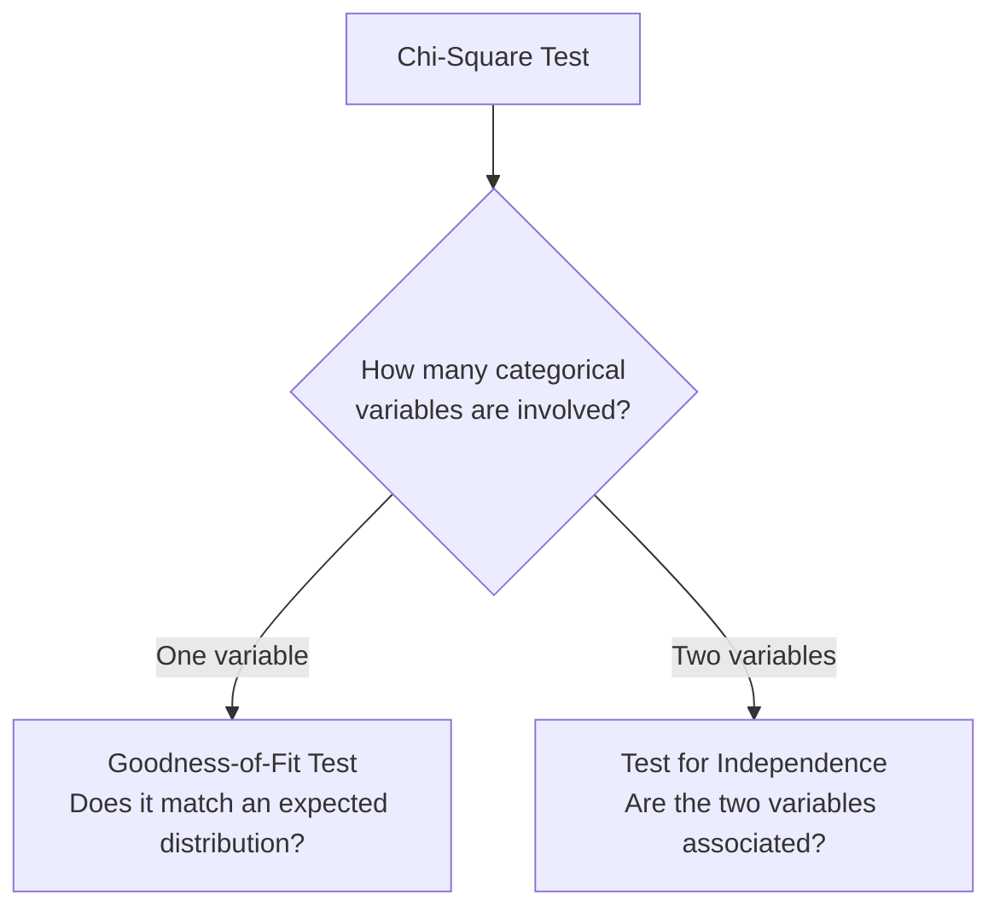
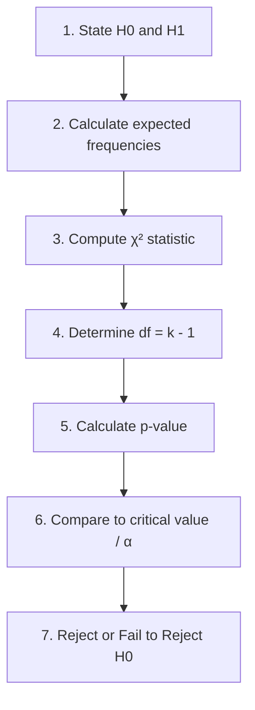
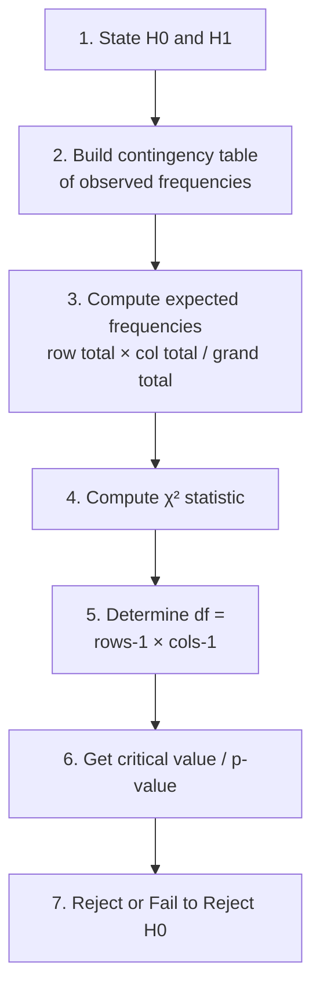
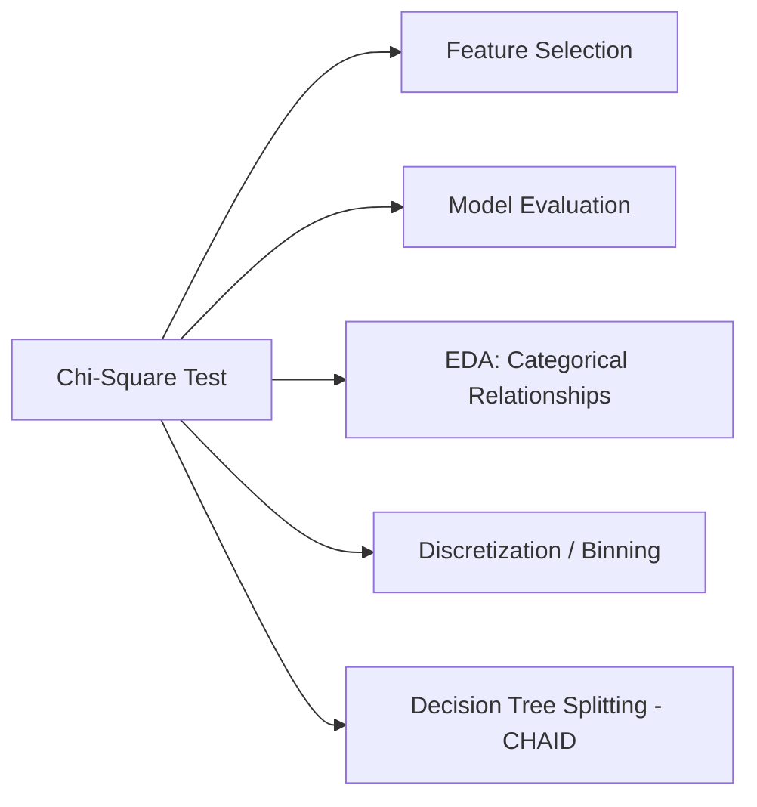

# Session 3 on Hypothesis Testing — Chi-Square Distribution & Chi-Square Tests

## Table of Contents

1. [Chi-Square Distribution](#chi-square-distribution)
2. [Chi-Square Test — Overview](#chi-square-test--overview)
3. [Chi-Square Goodness-of-Fit Test](#chi-square-goodness-of-fit-test)
4. [Chi-Square Test for Independence](#chi-square-test-for-independence)
5. [Applications in Machine Learning](#applications-in-machine-learning)
6. [Additional Notes (Beyond the Session Content)](#additional-notes-beyond-the-session-content)

---

## Chi-Square Distribution

The **Chi-Square distribution**, written as **χ² distribution**, is a continuous probability distribution widely used in statistical hypothesis testing, particularly for **goodness-of-fit tests** and **tests for independence** in contingency tables. It arises when the **sum of the squares of independent standard normal random variables** follows this distribution:

```
χ² = Z₁² + Z₂² + ... + Z_k² = Σ Zᵢ²  (i = 1 to k)

where each Zᵢ ~ N(0, 1)  (a standard normal random variable)
and k = degrees of freedom (df)
```

So specifically:
- χ² = Z² → df = 1
- χ² = Z₁² + Z₂² → df = 2
- χ² = Z₁² + Z₂² + Z₃² → df = 3
- χ² = Σᵢ₌₁ᵏ Zᵢ² → df = k

The Chi-Square distribution has a **single parameter**, the **degrees of freedom (df)**, which controls its shape and spread. Degrees of freedom are typically tied to the number of independent variables or constraints in a statistical problem.

**Key properties:**
1. **Continuous distribution**, defined only for **non-negative values** (since it's a sum of squares, it can never be negative).
2. **Positively skewed**, with the skewness **decreasing** as degrees of freedom increase.
3. **Mean = df** and **Variance = 2 × df**.
4. As degrees of freedom increase, the Chi-Square distribution **approaches the normal distribution** in shape.

```
Chi-Square Distribution shapes at different degrees of freedom (df)

Probability
0.5 |╲
    | ╲
0.4 |  ╲                                    df=1: sharply peaked
    |   ╲                                          at 0, decays fast
0.3 |    ╲___                                       (most skewed)
    |    /   ╲__
0.2 |   / df=2  ╲____
    |  |            ╲________
0.1 |  |   ___df=3___         ╲__________
    | ╱  ╱‾       ‾╲___              df=5 (less skewed,
0.0 |╱__╱_______________╲________________╲____peak_shifts_right)__
    0    2    4    6    8   10   12   14
                                              df=10 (even less skewed,
                                              starting to look bell-shaped,
                                              peak further right — mean=df)
```

### How to use it — step by step

There's no "formula to compute" here in the traditional sense (this section defines the distribution itself), but here's how to use its two headline properties as a beginner sanity check:

**Numeric example:** Suppose you're told a Chi-Square distribution has **df = 8**.
1. **Mean** = df = **8**
2. **Variance** = 2 × df = 2 × 8 = **16** (so standard deviation = √16 = 4)
3. Since df = 8 is moderately large, you'd expect the distribution to be **noticeably skewed but starting to resemble a normal-ish bump** shifted around x = 8, with most of its mass roughly between 0 and ~20 (given the spread implied by variance = 16).

This intuition matters practically: when you later compute a **χ² test statistic** and get a value like 9.95 with df = 4, you can quickly sanity-check that 9.95 is noticeably larger than the mean (4) for that distribution — a first hint (before formally checking the p-value) that the result might be statistically significant.

---

## Chi-Square Test — Overview

The **Chi-Square test** is a statistical hypothesis test used to determine:
- if there is a **significant association between categorical variables**, or
- if an **observed distribution of categorical data differs from an expected theoretical distribution**.

It is based on the Chi-Square (χ²) distribution and is commonly applied in two main scenarios:

1. **Chi-Square Goodness-of-Fit Test** — determines if the observed distribution of a **single** categorical variable matches an expected theoretical distribution (e.g., uniform or binomial).
2. **Chi-Square Test for Independence** (a.k.a. Test for Association) — determines whether there is a significant association between **two** categorical variables in a sample.



---

## Chi-Square Goodness-of-Fit Test

Determines if the observed distribution of a single categorical variable matches an expected theoretical distribution (uniform, binomial, Poisson, etc.). Useful for assessing whether sample data is consistent with an assumed distribution.

**Steps:**
1. Define hypotheses:
   - **H0:** The observed data follows the expected theoretical distribution.
   - **H1:** The observed data does **not** follow the expected theoretical distribution.
2. Calculate the **expected frequencies** for each category based on the theoretical distribution and sample size.
3. Compute the Chi-Square test statistic by comparing observed and expected frequencies.
4. Determine the **degrees of freedom**: df = k − 1 (where k = number of categories).
5. Calculate the **p-value** using the Chi-Square distribution with the calculated df.
6. Compare the test statistic to the critical value, or the p-value to α, to decide.

**Formula:**

```
       k    (Oᵢ − Eᵢ)²
χ² =  Σ    ───────────
      i=1      Eᵢ

Where:
Oᵢ = observed frequency in category i
Eᵢ = expected frequency in category i
df = k − 1  (k = number of categories)
```

**Assumptions:**
1. **Independence** — observations in the sample must be independent of each other.
2. **Categorical data** — the variable must be categorical (not continuous/ordinal), divided into mutually exclusive, exhaustive categories.
3. **Expected frequency ≥ 5** — each category should have an expected frequency of at least 5. Small expected frequencies make the Chi-Square approximation unreliable, raising the risk of both Type I and Type II errors.
4. **Fixed distribution** — the theoretical distribution being tested against must be specified **before** the test, not chosen based on the observed data (to avoid bias).

**Important note:** The Chi-Square Goodness-of-Fit test is a **non-parametric test** — it doesn't assume the data comes from a distribution with specific parameters (like a mean or standard deviation). It simply compares observed counts to expected counts directly.



### How to use it — step by step (Worked Example 1 — Fair Die)

**Scenario:** A six-sided die is rolled 60 times. We want to test if the die is fair (i.e., a uniform distribution across the 6 sides).

**Observed frequencies:** Side 1: 12, Side 2: 8, Side 3: 11, Side 4: 9, Side 5: 10, Side 6: 10

1. **Hypotheses:**
   - H0: The die is fair (uniform distribution — each side has probability 1/6).
   - H1: The die is not fair.
2. **Expected frequency per side** (uniform, n = 60 rolls, 6 sides): E = 60 / 6 = **10** for every side.
3. **Check assumption:** All expected frequencies = 10 ≥ 5 ✓
4. **Compute χ²:**
   ```
   χ² = (12−10)²/10 + (8−10)²/10 + (11−10)²/10 + (9−10)²/10 + (10−10)²/10 + (10−10)²/10
      = 4/10 + 4/10 + 1/10 + 1/10 + 0/10 + 0/10
      = 0.4 + 0.4 + 0.1 + 0.1 + 0 + 0
      = 1.0
   ```
5. **Degrees of freedom:** df = k − 1 = 6 − 1 = **5**
6. **Critical value** at α = 0.05, df = 5 ≈ **11.070** (from Chi-Square table)
7. **Decision:** Since χ² = 1.0 < 11.070 (and correspondingly, the p-value ≈ 0.96, far above 0.05) → **fail to reject H0**.
8. **Interpret:** The observed roll frequencies are consistent with a fair die — no evidence that the die is biased.

```
Chi-Square Distribution (df=5) — Fail to Reject region vs Reject region

Probability
0.15 |  ╱╲
     | ╱  ╲___
0.10 |╱       ╲______
     |                ╲_________
0.05 |   ↑                       ╲______________
     | χ²=1.0                                    ╲__________
0.00 |_(observed,__________________________|///////////////|_____
     0    2    4    6    8    10  11.07      15        20      25
                                    ↑
                              Critical value
                              (α=0.05, df=5)
      Fail to Reject H0 zone         |    Reject H0 zone (/////)
```

### How to use it — step by step (Worked Example 2 — Website Visits by Day)

**Scenario:** A marketing team hypothesizes that website visits are uniformly distributed across the 7 days of the week. They collect 4 weeks of data.

**Observed frequencies:** Monday: 420, Tuesday: 380, Wednesday: 410, Thursday: 400, Friday: 410, Saturday: 430, Sunday: 390
**Total visits:** 420+380+410+400+410+430+390 = **2,840**

1. **Hypotheses:**
   - H0: Website visits are uniformly distributed across days of the week.
   - H1: Website visits are not uniformly distributed across days of the week.
2. **Expected frequency per day** (uniform across 7 days): E = 2840 / 7 = **405.71** for every day.
3. **Check assumption:** All expected frequencies ≈ 405.71 ≥ 5 ✓
4. **Compute χ²:**
   ```
   χ² = (420−405.71)²/405.71 + (380−405.71)²/405.71 + (410−405.71)²/405.71
      + (400−405.71)²/405.71 + (410−405.71)²/405.71 + (430−405.71)²/405.71
      + (390−405.71)²/405.71

      = 0.503 + 1.630 + 0.045 + 0.081 + 0.045 + 1.454 + 0.609
      = 4.37
   ```
5. **Degrees of freedom:** df = k − 1 = 7 − 1 = **6**
6. **Critical value** at α = 0.05, df = 6 ≈ **12.592**
7. **Decision:** Since χ² = 4.37 < 12.592 (p-value ≈ 0.63, far above 0.05) → **fail to reject H0**.
8. **Interpret:** There's no significant evidence that website visits differ from a uniform distribution across the days of the week — the small day-to-day variation is consistent with random chance.

### How to use it — step by step (Example 3 — Family Births, framework only)

**Scenario (from the session):** A survey of 800 families, each with 4 children, recorded the number of male children per family (0, 1, 2, 3, or 4 boys). The question: *is this data consistent with male and female births being equally probable (p = 0.5 each)?*

> **Note:** The original notes reference a specific observed-frequency table (shown as an image in the source material) that wasn't captured in the extracted text of this PDF. Below is the **method framework** so you can plug in your own numbers from that table.

1. **Hypotheses:**
   - H0: Male and female births are equally probable (p = 0.5); the number of boys per family follows a **Binomial(n=4, p=0.5)** distribution.
   - H1: Male and female births are not equally probable.
2. **Expected frequencies:** For each category (0, 1, 2, 3, 4 boys), compute the Binomial(4, 0.5) probability, then multiply by 800 (total families):
   ```
   P(X=k) = C(4,k) × 0.5^k × 0.5^(4−k)     for k = 0,1,2,3,4

   P(X=0) = 1/16 = 0.0625   → E₀ = 800 × 0.0625 = 50
   P(X=1) = 4/16 = 0.25     → E₁ = 800 × 0.25   = 200
   P(X=2) = 6/16 = 0.375    → E₂ = 800 × 0.375  = 300
   P(X=3) = 4/16 = 0.25     → E₃ = 800 × 0.25   = 200
   P(X=4) = 1/16 = 0.0625   → E₄ = 800 × 0.0625 = 50
   ```
3. **Compute χ²** using your actual observed counts `O₀...O₄` from the survey table:
   ```
   χ² = (O₀−50)²/50 + (O₁−200)²/200 + (O₂−300)²/300 + (O₃−200)²/200 + (O₄−50)²/50
   ```
4. **Degrees of freedom:** df = k − 1 = 5 − 1 = **4**
5. **Compare** your computed χ² to the critical value at α = 0.05, df = 4 (≈ **9.488**), or check the corresponding p-value, to decide whether to reject H0.

---

## Chi-Square Test for Independence

Also called the **Chi-Square test for association** — determines whether there is a significant association between **two categorical variables** in a sample, by comparing observed frequencies in a **contingency table** against the frequencies expected under independence.

**Steps:**
1. State hypotheses:
   - **H0:** There is no association between the two categorical variables (they are independent).
   - **H1:** There is an association between the two categorical variables (they are dependent).
2. Create a **contingency table** with observed frequencies for each combination of categories.
3. Calculate **expected frequencies** for each cell, assuming H0 (independence) is true.
4. Compute the Chi-Square test statistic.
5. Determine degrees of freedom: **df = (rows − 1) × (columns − 1)**
6. Obtain the critical value or p-value using the Chi-Square distribution with the given df and significance level (commonly α = 0.05).
7. Compare the test statistic to the critical value (or p-value to α) to decide.

**Formula:**

```
       (O_ij − E_ij)²
χ² = Σ ───────────────       (summed over every cell i,j in the table)
            E_ij

Expected frequency for each cell:
             (row total) × (column total)
E_ij  =  ───────────────────────────────
                  grand total

df = (number of rows − 1) × (number of columns − 1)
```

**Assumptions:**
1. **Independence of observations** — observations should be independent; typically implies simple random sampling.
2. **Categorical variables** — both variables must be categorical (ordinal or nominal), not continuous.
3. **Adequate sample size** — expected frequency for each cell should be at least 5. If some cells fall below 5, consider **Fisher's exact test** instead.
4. **Fixed marginal totals** — row and column totals should be fixed before data collection.



### How to use it — step by step (Worked Example — Education Level vs Exercise Preference)

**Scenario:** A researcher investigates whether there's an association between education level and preferred exercise type among 150 individuals.

**Observed contingency table:**

| Education      | Yoga | Running | Swimming | Row Total |
|----------------|------|---------|----------|-----------|
| High School    | 15   | 20      | 10       | **45**    |
| Bachelor's     | 20   | 30      | 15       | **65**    |
| Master's/PhD   | 5    | 15      | 20       | **40**    |
| **Column Total** | **40** | **65** | **45** | **150**   |

1. **Hypotheses:**
   - H0: Education level and exercise preference are independent (no association).
   - H1: Education level and exercise preference are associated.
2. **Compute expected frequencies** for each cell using `E = (row total × column total) / grand total`:

| Education      | Yoga (E) | Running (E) | Swimming (E) |
|----------------|----------|-------------|--------------|
| High School    | 45×40/150 = **12.00** | 45×65/150 = **19.50** | 45×45/150 = **13.50** |
| Bachelor's     | 65×40/150 = **17.33** | 65×65/150 = **28.17** | 65×45/150 = **19.50** |
| Master's/PhD   | 40×40/150 = **10.67** | 40×65/150 = **17.33** | 40×45/150 = **12.00** |

3. **Check assumption:** All expected frequencies ≥ 5 ✓ (smallest is 10.67)
4. **Compute χ²** (summing `(O−E)²/E` across all 9 cells):
   ```
   High/Yoga:     (15−12.00)²/12.00   = 0.750
   High/Running:  (20−19.50)²/19.50   = 0.013
   High/Swim:     (10−13.50)²/13.50   = 0.907
   Bach/Yoga:     (20−17.33)²/17.33   = 0.410
   Bach/Running:  (30−28.17)²/28.17   = 0.119
   Bach/Swim:     (15−19.50)²/19.50   = 1.038
   PhD/Yoga:      (5−10.67)²/10.67    = 3.010
   PhD/Running:   (15−17.33)²/17.33   = 0.314
   PhD/Swim:      (20−12.00)²/12.00   = 5.333
   ─────────────────────────────────────────
   χ² ≈ 11.90
   ```
5. **Degrees of freedom:** df = (rows−1)×(cols−1) = (3−1)×(3−1) = **4**
6. **Critical value** at α = 0.05, df = 4 ≈ **9.488**
7. **Decision:** Since χ² ≈ 11.90 > 9.488 (p-value ≈ 0.018 < 0.05) → **reject H0**.
8. **Interpret:** There **is** a statistically significant association between education level and exercise preference in this sample.

> **Note on the original handwritten notes:** the source notes computed χ² ≈ 9.95 (using slightly rounded expected values like 12, 19, 13.5, 17, 28, 20, 10, 17, 12) and a p-value of 0.04, also landing on "reject H0" — the same conclusion reached here with the more precise expected values. This is a good reminder that **rounding expected frequencies during hand calculation can shift your exact χ² value**, but as long as you keep enough decimal precision, the final reject/fail-to-reject decision should be stable.

```
Chi-Square Distribution (df=4) — Reject H0 region shown

Probability
0.20 |╲
     | ╲
0.15 |  ╲___
     |      ╲____
0.10 |           ╲________
     |                     ╲_________
0.05 |                               ╲_____________|///////|
0.00 |______________________________________________|_______|_____
     0    2    4    6    8   9.49      11.90 ↑         15      20
                              ↑         (observed χ²,
                         Critical value   inside reject zone)
                         (α=0.05, df=4)
```

---

## Applications in Machine Learning

1. **Feature selection** — Chi-Square can be used as a filter-based feature selection method to rank and select the most relevant **categorical** features in a dataset, by measuring the association between each feature and the target variable, helping eliminate irrelevant or redundant features.
2. **Evaluation of classification models** — for multi-class classification, Chi-Square can compare observed vs expected class frequencies in a confusion matrix, assessing how well predictions align with actual class distributions.
3. **Analysing relationships between categorical features** — in exploratory data analysis (EDA), the test for independence can identify relationships between pairs of categorical features, informing feature engineering.
4. **Discretization of continuous variables** — when binning a continuous variable into categories, Chi-Square can help determine the optimal number of bins that best represent the relationship with the target variable.
5. **Variable selection in decision trees** — algorithms like **CHAID** (Chi-squared Automatic Interaction Detection) use the Chi-Square test to determine the most significant splitting variables at each node, producing more effective, interpretable trees.



---

## Additional Notes (Beyond the Session Content)

These extra notes weren't in the original material but are useful context for practical data-science work.

### Related concepts worth knowing

- **Fisher's exact test:** A more precise alternative to the Chi-Square test for independence when sample sizes are small and expected cell frequencies fall below 5 (the Chi-Square approximation becomes unreliable in that regime).
- **Yates' continuity correction:** For 2×2 contingency tables, a small correction is often applied to the Chi-Square statistic to reduce bias from approximating a discrete distribution with a continuous one.
- **Cramér's V:** While the Chi-Square test tells you *whether* an association is statistically significant, it doesn't tell you *how strong* the association is. Cramér's V is a normalized effect-size measure (0 to 1) derived from the Chi-Square statistic, useful for comparing association strength across different table sizes.
- **G-test (likelihood-ratio test):** An alternative to the Pearson Chi-Square test based on the log-likelihood ratio rather than squared differences — asymptotically equivalent but sometimes preferred in certain contexts (e.g., log-linear modeling).
- **Relationship to the Z-distribution:** A Chi-Square distribution with df = 1 is literally the square of a standard normal (Z) distribution — this is why df=1 in the Chi-Square table gives you related critical values to a two-tailed Z-test at the same α.
- **Additivity property:** If X ~ χ²(df₁) and Y ~ χ²(df₂) and X, Y are independent, then X + Y ~ χ²(df₁ + df₂) — this is why summing more squared standard normals just keeps increasing the degrees of freedom.

### Common ML / data-science use cases

- **`SelectKBest` with `chi2` scoring in scikit-learn** — a very common pattern for selecting the top-k categorical/count features most associated with a classification target before training a model.
- **A/B testing with categorical outcomes** — e.g., testing whether conversion rate (converted / not converted) differs significantly between two website variants; often implemented via a Chi-Square test for independence (or equivalently, a two-proportion Z-test for the 2×2 case).
- **Market basket / survey analysis** — checking whether responses to one survey question are associated with responses to another (e.g., "does region affect product preference?").
- **Data quality / drift checks** — comparing the categorical distribution of a new data batch against a historical baseline distribution using a goodness-of-fit test, to catch shifts in data composition over time.

### Quick Python Reference

```python
import numpy as np
import pandas as pd
from scipy import stats
import matplotlib.pyplot as plt

# ---------------------------------------------------------
# Chi-Square Goodness-of-Fit test (e.g., fair die example)
# ---------------------------------------------------------
observed = np.array([12, 8, 11, 9, 10, 10])          # 60 die rolls across 6 sides
expected = np.array([10, 10, 10, 10, 10, 10])         # uniform expectation

chi2_stat, p_value = stats.chisquare(f_obs=observed, f_exp=expected)
print(f"χ² = {chi2_stat:.3f}, p-value = {p_value:.4f}")
# df is automatically inferred as len(observed) - 1

# ---------------------------------------------------------
# Chi-Square Test for Independence (e.g., education vs exercise)
# ---------------------------------------------------------
contingency_table = pd.DataFrame(
    [[15, 20, 10],
     [20, 30, 15],
     [5,  15, 20]],
    index=["High School", "Bachelor's", "Master's/PhD"],
    columns=["Yoga", "Running", "Swimming"]
)

chi2_stat, p_value, dof, expected_freqs = stats.chi2_contingency(contingency_table)
print(f"χ² = {chi2_stat:.3f}, df = {dof}, p-value = {p_value:.4f}")
print("Expected frequencies:\n", expected_freqs)

# ---------------------------------------------------------
# Chi-Square distribution — visualizing the critical region
# ---------------------------------------------------------
df = 4
x = np.linspace(0, 20, 500)
y = stats.chi2.pdf(x, df)
critical_value = stats.chi2.ppf(0.95, df)  # critical value at alpha=0.05

plt.plot(x, y, label=f"Chi-Square (df={df})")
plt.fill_between(x, y, where=(x >= critical_value), color="red", alpha=0.4,
                  label=f"Reject region (χ² > {critical_value:.2f})")
plt.axvline(11.90, color="blue", linestyle="--", label="Observed χ² = 11.90")
plt.legend()
plt.title("Chi-Square Test — Critical Region at α=0.05")
plt.show()

# ---------------------------------------------------------
# Cramér's V — effect size for a Chi-Square test of independence
# ---------------------------------------------------------
def cramers_v(contingency_table):
    chi2_stat, _, _, _ = stats.chi2_contingency(contingency_table)
    n = contingency_table.to_numpy().sum()
    r, k = contingency_table.shape
    return np.sqrt((chi2_stat / n) / (min(r, k) - 1))

print(f"Cramér's V = {cramers_v(contingency_table):.3f}")
```
