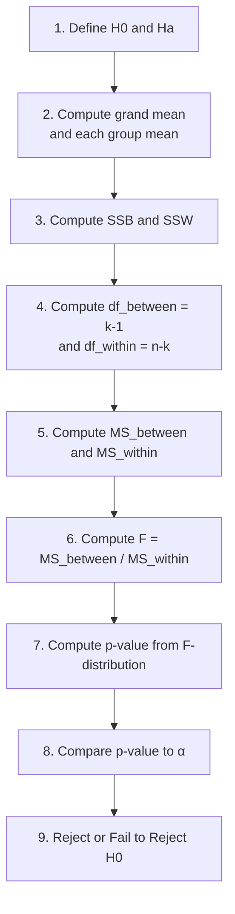
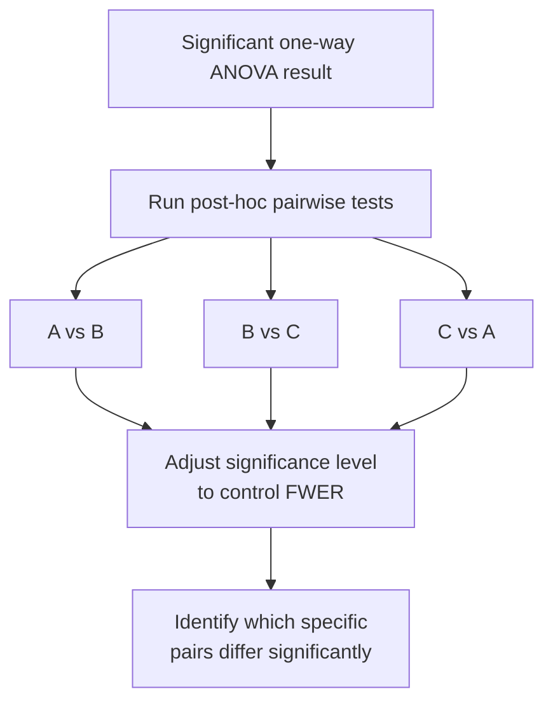
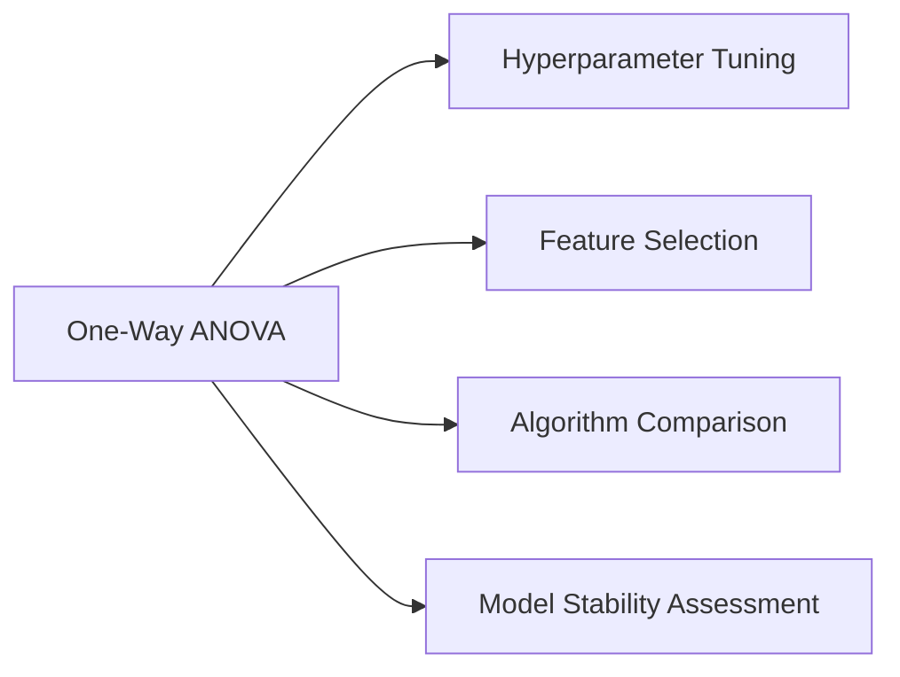

# Session 4 on Hypothesis Testing — F-Distribution & One-Way ANOVA


## Table of Contents

1. [F-Distribution](#f-distribution)
2. [One-Way ANOVA Test](#one-way-anova-test)
3. [ANOVA Assumptions](#anova-assumptions)
4. [Post-hoc Tests](#post-hoc-tests)
5. [Why t-test Is Not Used for More Than 2 Categories](#why-t-test-is-not-used-for-more-than-2-categories)
6. [Applications in Machine Learning](#applications-in-machine-learning)
7. [Additional Notes (Beyond the Session Content)](#additional-notes-beyond-the-session-content)

---

## F-Distribution

The **F-distribution** is a continuous probability distribution used in statistical hypothesis testing and **Analysis of Variance (ANOVA)**. It arises as the ratio of two independent Chi-Square distributions (each divided by their own degrees of freedom), which in turn are built from squared standard normal variables:

```
Normal  →  (squared)  →  Chi-Square  →  (ratio of two, each divided by df)  →  F-distribution
```

**Key properties:**
1. **Continuous probability distribution** used in hypothesis testing and ANOVA.
2. **Fisher-Snedecor distribution** — also known by this name, after Ronald Fisher and George Snedecor.
3. **Two degrees-of-freedom parameters** — df1 (numerator) and df2 (denominator). The distribution's exact shape depends on both.
4. **Positively skewed and bounded at zero** — since it's a ratio of two non-negative quantities (each itself a scaled Chi-Square), the F-distribution can never be negative.
5. **Testing equality of variances** — commonly used to test hypotheses about whether two variances are equal.
6. **Comparing statistical models** — used to compare the fit of different statistical models, particularly in ANOVA.
7. **F-statistic** — calculated by dividing the ratio of two sample variances or mean squares from an ANOVA table, then compared to critical values from the F-distribution.
8. **Wide applications** — used across psychology, education, economics, and the natural and social sciences.

**Formula (how the F-statistic is built from two Chi-Square distributions):**

```
        χ²₁ / df1
F  =  ─────────────
        χ²₂ / df2

Where χ²₁ has df1 degrees of freedom, χ²₂ has df2 degrees of freedom,
and the two are independent.
```

```
F-Distribution shapes for different (df1, df2) pairs

Probability
2.5 |        ╱╲
    |       ╱  ╲                              d1=1, d2=1  (very skewed,
2.0 |      ╱    ╲                                          spikes near 0,
    |     ╱      ╲                                         long right tail)
1.5 |    ╱        ╲
    |   ╱          ╲___
1.0 |  ╱  d1=5,d2=2     ╲________
    | ╱  ___________              ╲___________
0.5 |╱  ╱          d1=10,d2=1                  ╲_________________
    |  ╱  ___________________                                    ╲___
0.0 |_╱__╱___________________d1=100,d2=100_(narrow,_symmetric,_bell-like)__
    0    1        2        3        4        5

As BOTH df1 and df2 grow large (e.g., d1=100, d2=100), the F-distribution
narrows and starts to look roughly bell-shaped/symmetric around 1 —
this reflects that with large samples, the ratio of two variance estimates
should converge close to 1 if the true variances are equal.
```

### How to use it — step by step

There's no separate "formula to apply" here beyond what's shown above — the F-distribution itself is used as the **reference distribution** for the ANOVA F-test (see next section) and for comparing two variances directly.

**Numeric example — comparing two variances directly (an F-test for equality of variances):** Suppose Sample A (n₁ = 10) has variance s₁² = 25, and Sample B (n₂ = 8) has variance s₂² = 10. To test H0: σ₁² = σ₂² :
1. **Compute the F-statistic:** `F = s₁² / s₂² = 25 / 10 = 2.5` (larger variance goes in the numerator by convention)
2. **Degrees of freedom:** df1 = n₁ − 1 = 9, df2 = n₂ − 1 = 7
3. **Compare** F = 2.5 to the critical F-value at your chosen α (e.g., α = 0.05, df1=9, df2=7 → critical F ≈ 3.68)
4. Since 2.5 < 3.68 → **fail to reject H0** — no significant evidence the two variances differ.

---

## One-Way ANOVA Test

**One-way ANOVA (Analysis of Variance)** is a statistical method used to compare the means of **three or more independent groups** to determine if there are any significant differences between them. It is an extension of the t-test (which only compares **two** groups). The term "one-way" means there is only **one independent variable (factor)** with multiple levels (groups) in the analysis.

**Purpose:**
- **H0:** All group means are equal (μ₁ = μ₂ = ... = μₖ)
- **Ha:** At least one group mean is significantly different from the others.

**Steps:**
1. Define the null and alternative hypotheses.
2. Calculate the **overall mean (grand mean)** of all groups combined, and the mean of each group individually.
3. Calculate the **"between-group"** and **"within-group"** sum of squares (SS).
4. Find the between-group and within-group **degrees of freedom**.
5. Calculate the **"between-group"** and **"within-group"** mean squares (MS) by dividing each SS by its degrees of freedom.
6. Calculate the **F-statistic** by dividing the between-group mean square by the within-group mean square.
7. Calculate the **p-value** using the F-distribution and the appropriate degrees of freedom — the probability of obtaining an F-statistic as extreme or more extreme than the calculated value, assuming H0 is true.
8. Choose a significance level (α), typically 0.05.
9. Compare the p-value to α:
   - **If p-value ≤ α** → reject H0 — significant difference exists between at least one pair of group means.
   - **If p-value > α** → fail to reject H0 — not enough evidence of a significant difference.

**The ANOVA Table:**

| Source of Variation | Sum of Squares (SS) | Degrees of Freedom (df) | Mean Square (MS = SS/df) | F-ratio |
|---|---|---|---|---|
| **Between groups** | SSB = Σ nᵢ(x̄ᵢ − x̄̄)² | k − 1 | MS_between = SSB / (k−1) | **F = MS_between / MS_within** |
| **Within groups**  | SSW = ΣΣ(xᵢⱼ − x̄ᵢ)² | n − k | MS_within = SSW / (n−k)  | |
| **Total** | SST = ΣΣ(xᵢⱼ − x̄̄)² | n − 1 | | |

Where:
- `k` = number of groups
- `n` = total number of observations across all groups
- `nᵢ` = number of observations in group i
- `x̄ᵢ` = mean of group i
- `x̄̄` = grand mean (mean of all observations combined)
- `xᵢⱼ` = the j-th observation in group i

**Important:** SST = SSB + SSW (the total variation splits exactly into between-group and within-group parts) and correspondingly, df_total = df_between + df_within.



### How to use it — step by step (Worked Example)

> **Note:** The original notes reference "Example 1" and a "Geometric Intuition" section with visuals that weren't captured in the extracted text of this PDF. Below is a fully worked, from-scratch numeric example using the exact same ANOVA table structure and formulas from the session, so you can follow the same steps with your own real data.

**Scenario:** A researcher compares the effect of 3 different study methods (Group A, B, C) on test scores, with 3 students per group.

- Group A scores: `[4, 6, 8]` → mean x̄_A = 6
- Group B scores: `[7, 9, 11]` → mean x̄_B = 9
- Group C scores: `[10, 12, 14]` → mean x̄_C = 12

α = 0.05

1. **Hypotheses:**
   - H0: μ_A = μ_B = μ_C (no difference in average test scores across study methods)
   - Ha: at least one group mean differs
2. **Grand mean:** x̄̄ = (4+6+8+7+9+11+10+12+14) / 9 = 81 / 9 = **9**
3. **Between-group sum of squares (SSB):**
   ```
   SSB = n_A(x̄_A − x̄̄)² + n_B(x̄_B − x̄̄)² + n_C(x̄_C − x̄̄)²
       = 3(6−9)² + 3(9−9)² + 3(12−9)²
       = 3(9) + 3(0) + 3(9)
       = 27 + 0 + 27
       = 54
   ```
4. **Within-group sum of squares (SSW):**
   ```
   Group A: (4−6)² + (6−6)² + (8−6)² = 4 + 0 + 4 = 8
   Group B: (7−9)² + (9−9)² + (11−9)² = 4 + 0 + 4 = 8
   Group C: (10−12)² + (12−12)² + (14−12)² = 4 + 0 + 4 = 8

   SSW = 8 + 8 + 8 = 24
   ```
5. **Degrees of freedom:**
   ```
   k = 3 groups, n = 9 total observations
   df_between = k − 1 = 3 − 1 = 2
   df_within  = n − k = 9 − 3 = 6
   ```
6. **Mean squares:**
   ```
   MS_between = SSB / df_between = 54 / 2 = 27
   MS_within  = SSW / df_within  = 24 / 6 = 4
   ```
7. **F-statistic:**
   ```
   F = MS_between / MS_within = 27 / 4 = 6.75
   ```
8. **Critical value:** At α = 0.05, df1 = 2, df2 = 6 → critical F ≈ **5.14**
9. **Decision:** Since F = 6.75 > 5.14 (corresponding p-value ≈ 0.029, which is < 0.05) → **reject H0**.
10. **Interpret:** There is a statistically significant difference in average test scores between at least one pair of study-method groups. (Note: ANOVA alone doesn't tell us *which* pair differs — that requires a post-hoc test, covered next.)

**Full ANOVA table for this example:**

| Source | SS | df | MS | F |
|---|---|---|---|---|
| Between groups | 54 | 2 | 27 | **6.75** |
| Within groups  | 24 | 6 | 4  | |
| Total          | 78 | 8 | | |

```
F-Distribution (df1=2, df2=6) — Reject H0 region

Probability
0.6 |╲
    | ╲
0.4 |  ╲___
    |      ╲______
0.2 |             ╲____________
    |    ↑                     ╲__________|////////|
0.0 |__F=6.75(observed)_________________________|__|_______
    0    1    2    3    4    5.14  6.75    8       10
                              ↑     ↑
                         Critical  Observed F
                         value      (inside
                         (α=0.05)   reject zone)
```

---

## ANOVA Assumptions

1. **Independence** — observations within and between groups should be independent of each other; typically achieved through random sampling or random assignment.
2. **Normality** — data within each group should be approximately normally distributed. One-way ANOVA is fairly robust to moderate violations, but severe deviations can affect accuracy. If normality is in doubt, consider the **Shapiro-Wilk test** to check, or non-parametric alternatives (see Additional Notes).
3. **Homogeneity of variances (Homoscedasticity)** — the variances of the populations from which the samples are drawn should be approximately equal. Check this with **Levene's test** or **Bartlett's test**. If violated, use **Welch's ANOVA** instead.

### How to use it — step by step
1. Before running ANOVA, check group sizes and independence (design/sampling issue — no formula, just study design).
2. Run a normality check per group (e.g., Shapiro-Wilk test) if you're unsure.
3. Run a variance-equality check (e.g., Levene's test) across groups.
4. If assumptions hold reasonably well → proceed with the standard one-way ANOVA F-test shown above.
5. If variances are clearly unequal → switch to **Welch's ANOVA**, which adjusts the F-statistic and degrees of freedom to not assume equal variances.

---

## Post-hoc Tests

Post-hoc tests (a.k.a. post-hoc pairwise comparisons or multiple comparison tests) are used **after** a significant one-way ANOVA result, to determine **which specific groups or pairs of groups** have significantly different means. (Recall: ANOVA's F-test only tells you *that* a difference exists somewhere — not *where*.)

**Main purpose:** Control the **family-wise error rate (FWER)** — the probability of making at least one Type I error across multiple comparisons — by adjusting the significance level appropriately.

**Why this matters — the multiple-comparisons problem:**
If you run 3 separate pairwise t-tests (A-B, B-C, C-A), each at α = 0.05, the probability that **none** of them produces a false positive (assuming H0 is true for all) is:
```
P(no false positive across all 3 tests) = (1 − 0.05)³ = 0.95³ ≈ 0.857

So P(at least one false positive) = 1 − 0.857 ≈ 0.143 (about 14.3%)
```
This means your **actual** overall Type I error rate has crept up from the intended 5% to roughly **14–15%** — much higher than you signed up for! This is exactly why post-hoc corrections exist.



**Common post-hoc tests:**

1. **Bonferroni correction:** Adjusts the significance level (α) by **dividing it by the number of comparisons** being made. Conservative — simple to apply, but can have lower statistical power when many comparisons are involved.
2. **Tukey's HSD (Honestly Significant Difference):** Controls the FWER directly; used when sample sizes are equal and variances are assumed equal across groups. One of the most commonly used post-hoc tests.

### How to use it — step by step (Bonferroni Correction Worked Example)

**Scenario:** Continuing the study-method example above (3 groups: A, B, C), a significant ANOVA result (F = 6.75, p ≈ 0.029) means we now want to know *which* pair(s) differ. With 3 groups, there are **3 pairwise comparisons**: A-B, B-C, C-A.

1. **Desired overall (family-wise) significance level:** α = 0.05
2. **Number of comparisons:** m = 3 (A-B, B-C, C-A)
3. **Bonferroni-adjusted significance level per comparison:**
   ```
   α_adjusted = α / m = 0.05 / 3 = 0.0167
   ```
4. **Run each pairwise t-test** (e.g., using the independent two-sample t-test formulas from your Hypothesis Testing notes), and compare each resulting p-value against **0.0167** instead of the usual 0.05.
5. **Decision rule:** Only declare a specific pair "significantly different" if its p-value is **less than 0.0167** — this stricter threshold keeps your overall false-positive rate across all 3 tests close to the original 5% target.

**Why this works (sanity check):** If each of the 3 tests now uses α = 0.0167 instead of 0.05:
```
P(at least one false positive) ≈ 1 − (1 − 0.0167)³ ≈ 1 − 0.951 ≈ 0.049 ≈ 5%
```
This brings the overall Type I error rate back down close to the originally intended 5%.

---

## Why t-test Is Not Used for More Than 2 Categories

If you tried to use multiple pairwise t-tests instead of a single one-way ANOVA when comparing 3+ groups, you'd run into three problems:

1. **Increased Type I error:** Performing multiple individual t-tests increases the overall probability of a false positive. The more tests you run, the higher the chance you'll incorrectly reject at least one true null hypothesis — as shown numerically above (~14–15% instead of the intended 5%, for just 3 comparisons).
2. **Difficulty interpreting results:** With more groups, the number of pairwise comparisons grows quickly (e.g., 4 groups → 6 pairwise t-tests), making it hard to interpret and summarize the overall pattern of differences.
3. **Inefficiency:** Multiple t-tests are less efficient than a single test (one-way ANOVA) that uses information from **all** groups simultaneously to estimate within-group and between-group variability, leading to more accurate conclusions.

### How to use it — step by step
**Numeric example:** For **k** groups, the number of pairwise comparisons is `k(k−1)/2`:
- 3 groups → 3(2)/2 = **3** comparisons
- 4 groups → 4(3)/2 = **6** comparisons
- 5 groups → 5(4)/2 = **10** comparisons

As you can see, the number of comparisons — and therefore the risk of inflated Type I error if you ran separate t-tests — grows quickly. This is precisely why one-way ANOVA (a single test across all groups at once) is the correct tool, with post-hoc tests applied only afterward, and only if the ANOVA result is significant.

---

## Applications in Machine Learning

1. **Hyperparameter tuning** — one-way ANOVA can compare model performance across different hyperparameter settings (treating each setting as a "group") to see if there are significant differences.
2. **Feature selection** — used as a univariate feature-selection method, especially when the target variable is categorical with more than two levels; ANOVA is run per feature, and features with low p-values are considered more relevant for prediction.
3. **Algorithm comparison** — comparing performance metrics (accuracy, F1 score, etc.) of different ML algorithms across multiple runs or cross-validation folds, to determine if differences are statistically significant.
4. **Model stability assessment** — comparing a model's performance across different random seeds or initializations; large significant variation may indicate the model is unstable or highly sensitive to initial conditions.



---

## Additional Notes (Beyond the Session Content)

These extra notes weren't in the original material but are useful context for practical data-science work.

### Related concepts worth knowing

- **Two-way ANOVA:** Extends one-way ANOVA to examine the effect of **two** independent factors simultaneously (e.g., "gender" and "treatment type"), and can also test for an **interaction effect** between them — something one-way ANOVA cannot detect.
- **Welch's ANOVA:** The go-to alternative when the homogeneity-of-variance assumption is violated — it doesn't assume equal variances across groups, similar in spirit to how Welch's t-test relaxes the equal-variance assumption for two-group comparisons.
- **Kruskal-Wallis test:** The non-parametric alternative to one-way ANOVA, used when normality is badly violated — it compares group **ranks** rather than raw means.
- **Effect size for ANOVA (eta-squared, η²):** Just like Cohen's d for t-tests, η² = SSB/SST tells you what proportion of total variance is explained by group membership — useful for judging practical significance, not just statistical significance. In the worked example above, η² = 54/78 ≈ 0.69, meaning about 69% of the total variance in test scores is explained by which study-method group a student was in — a very large effect.
- **Repeated-measures ANOVA:** The extension of the paired t-test idea to 3+ related/repeated measurements on the same subjects (e.g., measuring the same people at 3 different time points).
- **MANOVA (Multivariate ANOVA):** Extends ANOVA to handle **multiple dependent variables** simultaneously, rather than just one.

### Common ML / data-science use cases

- **`f_classif` / `f_regression` feature scoring in scikit-learn** — both are direct implementations of the ANOVA F-test, commonly used inside `SelectKBest` for univariate feature selection.
- **A/B/n testing** — when testing more than two variants of a product/webpage/campaign at once, one-way ANOVA is the statistically correct first step (followed by post-hoc tests) rather than running many separate pairwise t-tests.
- **Cross-validation fold comparison across multiple models** — comparing 3+ candidate models' performance across the same CV folds using (repeated-measures) ANOVA, rather than a series of pairwise t-tests, to properly control the overall error rate.
- **Sensor / experimental condition comparisons** — comparing measurements across 3+ experimental conditions (e.g., different manufacturing settings, different drug dosages) in scientific and engineering contexts.

### Quick Python Reference

```python
import numpy as np
import pandas as pd
from scipy import stats
import matplotlib.pyplot as plt

# ---------------------------------------------------------
# One-way ANOVA
# ---------------------------------------------------------
group_a = np.array([4, 6, 8])
group_b = np.array([7, 9, 11])
group_c = np.array([10, 12, 14])

f_stat, p_value = stats.f_oneway(group_a, group_b, group_c)
print(f"F = {f_stat:.3f}, p-value = {p_value:.4f}")

# ---------------------------------------------------------
# Checking ANOVA assumptions
# ---------------------------------------------------------
# Normality check per group (Shapiro-Wilk)
for name, group in zip(["A", "B", "C"], [group_a, group_b, group_c]):
    stat, p = stats.shapiro(group)
    print(f"Group {name} normality p-value: {p:.4f}")

# Homogeneity of variance check (Levene's test)
levene_stat, levene_p = stats.levene(group_a, group_b, group_c)
print(f"Levene's test p-value: {levene_p:.4f}")

# ---------------------------------------------------------
# Post-hoc test — Tukey's HSD
# ---------------------------------------------------------
from statsmodels.stats.multicomp import pairwise_tukeyhsd

data = np.concatenate([group_a, group_b, group_c])
labels = ["A"]*len(group_a) + ["B"]*len(group_b) + ["C"]*len(group_c)

tukey_result = pairwise_tukeyhsd(endog=data, groups=labels, alpha=0.05)
print(tukey_result)

# ---------------------------------------------------------
# Post-hoc test — Bonferroni-corrected pairwise t-tests
# ---------------------------------------------------------
from itertools import combinations

groups = {"A": group_a, "B": group_b, "C": group_c}
pairs = list(combinations(groups.keys(), 2))
alpha = 0.05
alpha_adjusted = alpha / len(pairs)

for g1, g2 in pairs:
    t_stat, p_val = stats.ttest_ind(groups[g1], groups[g2])
    significant = "significant" if p_val < alpha_adjusted else "not significant"
    print(f"{g1} vs {g2}: p = {p_val:.4f} ({significant} at adjusted α = {alpha_adjusted:.4f})")

# ---------------------------------------------------------
# Effect size — eta-squared
# ---------------------------------------------------------
def eta_squared(*groups):
    all_data = np.concatenate(groups)
    grand_mean = np.mean(all_data)
    ssb = sum(len(g) * (np.mean(g) - grand_mean)**2 for g in groups)
    sst = sum((all_data - grand_mean)**2)
    return ssb / sst

print(f"Eta-squared: {eta_squared(group_a, group_b, group_c):.3f}")

# ---------------------------------------------------------
# Visualizing the F-distribution and critical region
# ---------------------------------------------------------
df1, df2 = 2, 6
x = np.linspace(0.01, 10, 500)
y = stats.f.pdf(x, df1, df2)
critical_value = stats.f.ppf(0.95, df1, df2)

plt.plot(x, y, label=f"F-distribution (df1={df1}, df2={df2})")
plt.fill_between(x, y, where=(x >= critical_value), color="red", alpha=0.4,
                  label=f"Reject region (F > {critical_value:.2f})")
plt.axvline(6.75, color="blue", linestyle="--", label="Observed F = 6.75")
plt.legend()
plt.title("One-Way ANOVA — F-Distribution Critical Region")
plt.show()
```
