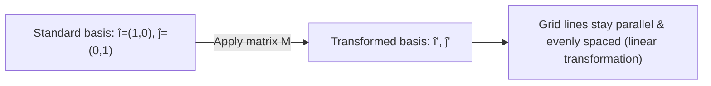

# Session 2 — Linear Algebra: Matrices

> **Category:** Linear Algebra (place this in a `Linear-Algebra/` folder, not under Descriptive Statistics or Probability & Distributions)

## What are Matrices

A **matrix** is a rectangular array of numbers, symbols, or expressions arranged in rows and columns. The individual entries are called **elements** of the matrix.

### Order and Notation

A matrix with `m` rows and `n` columns is said to have **order `m × n`**, written as `A(m×n)`. An element in row `i`, column `j` is denoted `a[i,j]`.

```
        col1 col2 col3
row1  [  1    2    3  ]
row2  [  4    5    6  ]
```
This is a `2 × 3` matrix.

### How to use it — step by step
1. Count the number of rows (`m`).
2. Count the number of columns (`n`).
3. Write the order as `m × n`.
4. Refer to a specific entry using its row and column index.

**Worked example:** In the matrix above, `a[2,3] = 6` (row 2, column 3).

### Uses and Application Areas

- **Linear Systems:** `Ax = b` represents a system of linear equations, solvable via Gaussian elimination, LU decomposition, or matrix inversion.
- **Linear Transformations:** rotation, scaling, and reflection are represented as matrices acting on vectors.
- **Eigenvalues/Eigenvectors:** `Av = λv` — used in differential equations, stability analysis, and diagonalization.
- **Graph Theory:** adjacency, incidence, and Laplacian matrices represent graphs.
- **Markov Chains:** transition matrices model probabilistic state changes.
- **Computer Graphics:** matrices represent translation, rotation, scaling, and projection of 2D/3D models.
- **Control Theory:** state-space models and transfer functions use matrices to design control strategies.
- **Optimization:** linear/quadratic/semidefinite programming rely on matrices to represent constraints and objectives.

---

## Types of Matrices

| Type | Description |
|---|---|
| Row Matrix | Single row, order `1 × n` |
| Column Matrix | Single column, order `n × 1` |
| Square Matrix | Equal rows and columns, `n × n` |
| Diagonal Matrix | Square matrix, all off-diagonal elements = 0 |
| Scalar Matrix | Diagonal matrix where all diagonal entries are equal |
| Identity Matrix | Diagonal matrix with all diagonal entries = 1 |
| Zero Matrix | All elements are 0 |
| Non-square Matrix | Rows ≠ columns (further split into "tall" and "wide") |

```
Diagonal:        Identity:        Zero:
[5 0 0]          [1 0 0]          [0 0 0]
[0 3 0]          [0 1 0]          [0 0 0]
[0 0 7]          [0 0 1]          [0 0 0]
```

### How to use it — step by step
1. Check if rows = columns → square, else non-square.
2. If square, check if all off-diagonal entries are zero → diagonal.
3. If diagonal and all diagonal values are equal → scalar matrix.
4. If diagonal and all diagonal values = 1 → identity matrix.

**Worked example:** `I = [[1,0],[0,1]]` is a `2×2` identity matrix — multiplying any vector by `I` leaves it unchanged: `I · (3,5) = (3,5)`.

---

## Matrix Equality

Two matrices are equal only if they have the **same order** and **every corresponding element is equal**.

### How to use it — step by step
1. Check both matrices have the same number of rows and columns.
2. Compare each element pair by pair.
3. If all match, the matrices are equal.

**Worked example:** `A = [[1,2],[3,4]]` and `B = [[1,2],[3,4]]` are equal. `C = [[1,2],[3,5]]` is **not** equal to `A` since `a[2,2]=4 ≠ c[2,2]=5`.

---

## Scalar Operations

- **Scalar addition/subtraction:** add/subtract a constant to every element.
- **Scalar multiplication:** multiply every element by a constant `k`.
- **Negative of a matrix:** multiply by `-1`.
- **Rule:** `k(A+B) = kA + kB`

### How to use it — step by step
1. Take the scalar `k`.
2. Apply the operation (add/subtract/multiply) to every element of the matrix.

**Worked example:** `A = [[1,2],[3,4]]`, `k = 2`:
```
kA = [[2,4],[6,8]]
```

---

## Matrix Addition and Subtraction

Matrices are added/subtracted **element-wise**, and must be of the **same order**.

**Rules:**
- `A + B = B + A` (commutative)
- `(A+B)+C = A+(B+C)` (associative)
- Additive Identity: `A + 0 = A`
- Additive Inverse: `A + (-A) = 0`

### How to use it — step by step
1. Confirm both matrices have the same order.
2. Add (or subtract) each corresponding pair of elements.

**Worked example:** `A = [[1,2],[3,4]]`, `B = [[5,6],[7,8]]`:
```
A + B = [[1+5, 2+6], [3+7, 4+8]] = [[6,8],[10,12]]
A - B = [[1-5, 2-6], [3-7, 4-8]] = [[-4,-4],[-4,-4]]
```

---

## Matrix Multiplication

For `A (m×n)` and `B (n×p)`, the product `C = AB` is `(m×p)`, where:

```
C[i,j] = Σ (A[i,k] · B[k,j])  for k = 1 to n
```

**Rules:**
- `A·B ≠ B·A` (generally not commutative)
- `(AB)C = A(BC)` (associative)
- `A(B+C) = AB + AC` (distributive)
- Multiplicative Identity: `A·I = I·A = A`

### How to use it — step by step
1. Confirm the number of columns of `A` equals the number of rows of `B`.
2. For each output entry `C[i,j]`, take row `i` of `A` and column `j` of `B`.
3. Multiply corresponding entries and sum them.
4. Repeat for every `(i,j)` position.

**Worked example:** `A = [[1,2],[3,4]]`, `B = [[5,6],[7,8]]`:
```
C[1,1] = (1×5)+(2×7) = 5+14 = 19
C[1,2] = (1×6)+(2×8) = 6+16 = 22
C[2,1] = (3×5)+(4×7) = 15+28 = 43
C[2,2] = (3×6)+(4×8) = 18+32 = 50

AB = [[19,22],[43,50]]
```

**Why order matters (non-square example):** if `A` is `2×3` and `B` is `3×2`, then `AB` is `2×2` but `BA` is `3×3` — they aren't even the same size, let alone equal. Always check inner dimensions match (`columns of A = rows of B`) before multiplying.

---

## Transpose of a Matrix

The **transpose** `A^T` flips a matrix over its diagonal — rows become columns.

```
(A^T)[i,j] = A[j,i]
```

**Rules:**
- `(A^T)^T = A`
- `(A+B)^T = A^T + B^T`
- `(AB)^T = B^T·A^T`
- **Symmetric matrix:** `A^T = A`
- **Skew-symmetric matrix:** `A^T = -A`

### How to use it — step by step
1. Take the first row of `A` and make it the first column of `A^T`.
2. Repeat for every row.

**Worked example:** `A = [[1,2,3],[4,5,6]]` (2×3):
```
A^T = [[1,4],
       [2,5],
       [3,6]]    (3×2)
```

---

## Determinant

The **determinant** is a scalar computed from a **square matrix** that indicates invertibility and volume-scaling.

**2×2 formula:**
```
det([[a,b],[c,d]]) = ad - bc
```

**Rule:** `det(A) = det(A^T)`. A matrix with `det(A) = 0` is called **singular** (non-invertible).

### How to use it — step by step
1. For a 2×2 matrix `[[a,b],[c,d]]`, compute `ad - bc`.
2. For larger matrices, expand along a row/column using minors and cofactors (see below).

**Worked example:** `A = [[4,3],[6,3]]`:
```
det(A) = (4×3) - (3×6) = 12 - 18 = -6
```
Since `det(A) ≠ 0`, `A` is non-singular (invertible).

**3×3 determinant (expansion along the first row):** for a larger matrix, expand using minors and cofactors (introduced next):
```
det([[1,2,3],[4,5,6],[7,8,10]])
= 1×det([[5,6],[8,10]]) − 2×det([[4,6],[7,10]]) + 3×det([[4,5],[7,8]])
= 1×(50-48) − 2×(40-42) + 3×(32-35)
= 1×2 − 2×(-2) + 3×(-3)
= 2 + 4 − 9 = -3
```

---

## Minor

The **minor** `M[i,j]` of an element `a[i,j]` is the determinant of the smaller matrix formed by deleting row `i` and column `j`.

### How to use it — step by step
1. Choose the element `a[i,j]` whose minor you want.
2. Delete its entire row and column from the matrix.
3. Compute the determinant of the remaining matrix.

**Worked example:** For `A = [[1,2,3],[4,5,6],[7,8,10]]`, the minor of `a[1,1]=1` is found by deleting row 1 and column 1:
```
remaining = [[5,6],[8,10]]
M[1,1] = (5×10) - (6×8) = 50 - 48 = 2
```

---

## Cofactor

The **cofactor** of `a[i,j]` is:
```
A[i,j] = (-1)^(i+j) · M[i,j]
```
The determinant equals the sum of the products of elements of any row (or column) with their corresponding cofactors.

### How to use it — step by step
1. Compute the minor `M[i,j]`.
2. Multiply it by `(-1)^(i+j)` (this alternates the sign in a checkerboard pattern).

**Worked example:** Using `M[1,1] = 2` from above:
```
A[1,1] = (-1)^(1+1) · 2 = (+1) · 2 = 2
```
For `a[1,2]=2`, delete row 1, column 2 → `[[4,6],[7,10]]`, `M[1,2] = 40-42 = -2`, cofactor `A[1,2] = (-1)^3·(-2) = 2`.

---

## Adjoint

The **adjugate (adjoint)** of a matrix is formed by replacing every element with its cofactor, then **transposing** the resulting cofactor matrix.

```
adj(A) = (Cofactor matrix of A)^T
```

### How to use it — step by step
1. Compute the cofactor for every element of `A`.
2. Arrange these cofactors into a matrix (same shape as `A`).
3. Transpose that cofactor matrix.

**Worked example:** For `A = [[4,3],[6,3]]`:
```
Cofactors: A[1,1]=3, A[1,2]=-6, A[2,1]=-3, A[2,2]=4
Cofactor matrix = [[3,-6],[-3,4]]
adj(A) = transpose = [[3,-3],[-6,4]]
```

---

## Inverse of a Matrix

The **inverse** `A⁻¹` satisfies `A·A⁻¹ = I`. It only exists for **square, non-singular** matrices (`det(A) ≠ 0`).

```
A⁻¹ = adj(A) / det(A)
```

**Rule:** `(AB)⁻¹ = B⁻¹A⁻¹`

### How to use it — step by step
1. Compute `det(A)`. If it's 0, stop — no inverse exists.
2. Compute `adj(A)`.
3. Divide every element of `adj(A)` by `det(A)`.

**Worked example:** `A = [[4,3],[6,3]]`, `det(A) = -6`, `adj(A) = [[3,-3],[-6,4]]`:
```
A⁻¹ = (1/-6) · [[3,-3],[-6,4]] = [[-0.5, 0.5],[1, -0.667]]
```
Check: `A · A⁻¹ ≈ I` (identity).

---

## Solving a System of Linear Equations

A system `Ax = b` can be solved by:
```
x = A⁻¹b
```

### How to use it — step by step
1. Write the system in matrix form `Ax = b`.
2. Compute `A⁻¹`.
3. Multiply `A⁻¹` by `b` to get the solution vector `x`.

**Worked example:** Solve:
```
4x + 3y = 10
6x + 3y = 12
```
Here `A = [[4,3],[6,3]]`, `b = (10,12)`, `A⁻¹ = [[-0.5, 0.5],[1, -0.667]]`:
```
x = A⁻¹·b = [(-0.5×10)+(0.5×12), (1×10)+(-0.667×12)]
  = [(-5+6), (10-8)]
  = [1, 2]
```
So `x = 1`, `y = 2`. Check: `4(1)+3(2)=10` ✓, `6(1)+3(2)=12` ✓

---

## Matrix as a Linear Transformation of Basis Vectors

A matrix's columns show where the standard basis vectors `î = (1,0)` and `ĵ = (0,1)` land after transformation.



### How to use it — step by step
1. Write the matrix columns as the images of `î` and `ĵ`.
2. For matrix `M = [[1,3],[2,1]]`, column 1 `(1,2)` is where `î` lands (`î'`), column 2 `(3,1)` is where `ĵ` lands (`ĵ'`).
3. Any vector's transformed position is a combination of these new basis vectors.

**Worked example:** `M = [[1,3],[2,1]]` — î maps to `(1,2)`, ĵ maps to `(3,1)`. The grid of parallel lines (shown in the original notes) tilts accordingly, but all lines remain straight, parallel, and evenly spaced — the hallmark of a linear transformation.

```
Before:                 After (M = [[1,3],[2,1]]):
  ĵ                          ĵ'
  ^                         /
  |                        /
  +---> î                 +------> î'
```

---

## Additional Notes (Beyond the Session Content)

- **Rank of a matrix:** the number of linearly independent rows/columns — determines whether a system has a unique solution, infinite solutions, or none.
- **Eigenvalues & eigenvectors:** solve `det(A - λI) = 0` to find eigenvalues; used in PCA, stability analysis, and Google's PageRank algorithm.
- **LU / QR / SVD decomposition:** industrial-strength alternatives to direct inversion, far more numerically stable for large matrices in ML pipelines.
- **Why avoid explicit matrix inversion in practice:** computing `A⁻¹` directly is numerically unstable for large matrices; libraries like numpy/scipy use decomposition-based solvers (`np.linalg.solve`) instead.
- **Matrices in neural networks:** every fully-connected layer is literally `y = Wx + b`, a matrix multiplication followed by a bias vector addition.

### Quick Python Reference

```python
import numpy as np

A = np.array([[4, 3], [6, 3]])
B = np.array([[5, 6], [7, 8]])

# Order / shape
print(A.shape)                       # (2, 2)

# Scalar multiplication
print(2 * A)

# Matrix addition/subtraction
print(A + B)
print(A - B)

# Matrix multiplication
print(A @ B)                         # or np.matmul(A, B)

# Transpose
print(A.T)

# Determinant
print(np.linalg.det(A))              # -6.0

# Inverse (only if det != 0)
print(np.linalg.inv(A))

# Solve Ax = b directly (preferred over computing A_inv manually)
b = np.array([10, 12])
x = np.linalg.solve(A, b)            # [1., 2.]
print(x)

# Identity matrix
I = np.eye(2)
print(I)
```
