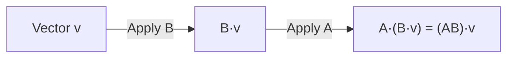
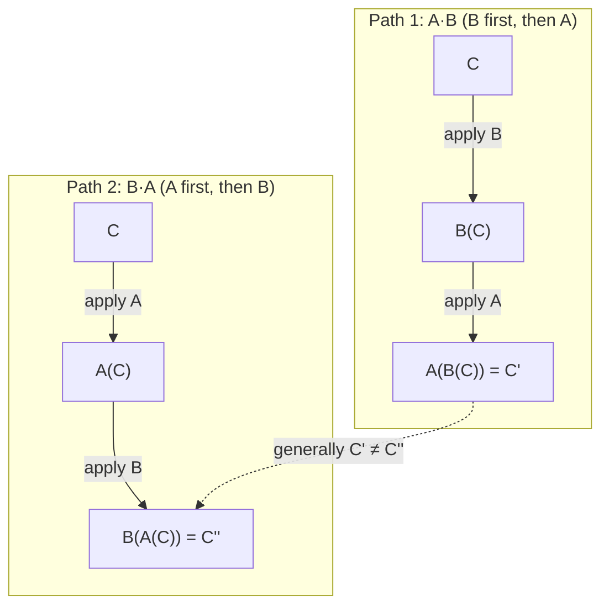

# Session 3 — Linear Algebra: Linear Transformations

> **Category:** Linear Algebra (place this in a `Linear-Algebra/` folder, not under Descriptive Statistics or Probability & Distributions)

## Basis Vectors

The **standard basis vectors** in 2D are `î = (1,0)` and `ĵ = (0,1)`. Any vector can be written as a combination (linear combination) of the basis vectors.

```
v = x·î + y·ĵ
```

### How to use it — step by step
1. Identify the x and y components of your vector.
2. Express the vector as `x·î + y·ĵ`.

**Worked example:** `v = (3, 4) = 3·(1,0) + 4·(0,1) = (3,0) + (0,4) = (3,4)`

---

## Linear Transformations

A **linear transformation** is a function that maps vectors to vectors while preserving straight lines and keeping the origin fixed (lines remain parallel and evenly spaced after transformation). Every linear transformation can be represented by a matrix.

```
T(v) = Mv
```

### How to use it — step by step
1. Find where the transformation sends `î` and `ĵ` (this becomes the columns of matrix `M`).
2. To transform any vector `v = (x,y)`, compute `Mv`.

**Worked example:** If `î → (2,0)` and `ĵ → (0,3)` (a stretch), then `M = [[2,0],[0,3]]`. For `v=(1,1)`:
```
Mv = [[2,0],[0,3]] · [1,1]^T = (2×1+0×1, 0×1+3×1) = (2,3)
```

---

## Linear Transformation in 3D

The same idea extends to 3D: a `3×3` matrix transforms 3D basis vectors `î=(1,0,0)`, `ĵ=(0,1,0)`, `k̂=(0,0,1)`, and any 3D vector is transformed by matrix-vector multiplication.

```
T(v) = Mv,   where M is 3×3, v is 3×1
```

### How to use it — step by step
1. Determine the images of `î`, `ĵ`, `k̂` under the transformation — these become the 3 columns of `M`.
2. Multiply `M` by any vector `v` to find its transformed position.

**Worked example:** `M = [[1,0,0],[0,2,0],[0,0,3]]` (a scaling transformation), `v = (1,1,1)`:
```
Mv = (1×1, 2×1, 3×1) = (1, 2, 3)
```

---

## Matrix Multiplication as Composition

Applying transformation `B` first, then `A`, is equivalent to applying the single combined matrix `AB` (note the order: rightmost matrix acts first).



### How to use it — step by step
1. To apply "B first, then A" to a vector, compute the product `AB` (A on the left, B on the right).
2. Multiply the resulting combined matrix by the vector.

**Worked example:** `A = [[1,0],[0,2]]` (stretch y by 2), `B = [[0,-1],[1,0]]` (90° rotation), `v=(1,0)`:
```
Bv = (0,1)          # rotate first
A(Bv) = (0,2)       # then stretch
```
Equivalently, `AB = [[1,0],[0,2]]·[[0,-1],[1,0]] = [[0,-1],[2,0]]`, and `(AB)v = (0,2)` — same result.

**Special case — eigenvectors:** most vectors change *direction* when transformed. But for any matrix, there are special directions where a vector only gets **scaled**, not rotated: `Mv = λv`. These are the matrix's **eigenvectors**, and `λ` is the corresponding **eigenvalue**. For `M = [[2,0],[0,3]]`, `v=(1,0)` is an eigenvector with eigenvalue `λ=2` (it just gets stretched, not rotated), and `v=(0,1)` is an eigenvector with eigenvalue `λ=3`.

---

## Test of Commutative Law: A·B ≠ B·A

Matrix multiplication is generally **not commutative** — the order matters because it corresponds to the order transformations are applied.

```
A·B ≠ B·A     (in general)
A(BC) = (AB)C  (associative law still holds)
```



### How to use it — step by step
1. Pick two matrices `A` and `B`.
2. Compute `AB` and `BA` separately.
3. Compare — in most cases they will differ.

**Worked example:** `A = [[1,1],[0,1]]` (shear), `B = [[1,0],[1,1]]` (shear the other way):
```
AB = [[1,1],[0,1]]·[[1,0],[1,1]] = [[2,1],[1,1]]
BA = [[1,0],[1,1]]·[[1,1],[0,1]] = [[1,1],[1,2]]
```
`AB ≠ BA` — confirms multiplication order changes the outcome. Visually: "B then A" tilts a grid differently than "A then B."

---

## Why the Determinant Is Possible Only for Square Matrices

The determinant represents a **scaling factor** for how much a transformation expands or shrinks space (area in 2D, volume in 3D). This concept only makes sense when the **input and output spaces have the same dimension** — which is exactly what a square matrix guarantees.

### How to use it — step by step
1. Check that the matrix is square (`n × n`).
2. If square, the determinant tells you the factor by which the transformation scales area/volume.
3. If non-square, there is no consistent notion of "scaling factor" since input and output live in different-dimensional spaces.

**Worked example:** For `M = [[2,0],[0,3]]`, `det(M) = 6` — meaning any region's area is scaled by a factor of 6 under this transformation. A unit square (area 1) becomes a `2×3` rectangle (area 6). ✓

### Negative Determinant & Singular Matrices

- A **negative determinant** means the transformation **flips orientation** (like a mirror reflection) in addition to scaling.
- A **singular matrix** (`det = 0`) collapses space into a lower dimension (e.g., a 2D plane squashed onto a line or point) — information is lost and the transformation is not invertible.

**Worked example:** `M = [[1,2],[2,4]]`: `det(M) = (1×4)-(2×2) = 0` → singular. Indeed, row 2 is just `2×` row 1, so the transformation squashes the plane onto a single line.

---

## Inverse — Why A·A⁻¹ = I and Why Only Square Matrices Have Inverses

The inverse `A⁻¹` "undoes" the transformation done by `A`, returning every transformed vector to its original position — hence `A·A⁻¹ = I` (the identity, i.e., "do nothing").

An inverse is possible only for **square** matrices because it requires the transformation to be **bijective** (both injective/one-to-one and surjective/onto):

1. **Tall matrix** (`m > n`, more rows than columns): maps a lower-dimensional space into a higher-dimensional one. Not surjective — some outputs in the bigger space have no corresponding input, so no inverse can map every output back.
2. **Wide matrix** (`m < n`, more columns than rows): maps a higher-dimensional space into a lower-dimensional one (dimension reduction). Not injective — multiple different inputs map to the same output, so there's no unique way to invert.

Only a square matrix can represent a transformation between spaces of the **same** dimension, which is a prerequisite for bijectivity. Even then, only **non-singular** square matrices (`det ≠ 0`) are actually invertible.

### How to use it — step by step
1. Check the matrix is square. If not — stop, no inverse exists.
2. Check `det(A) ≠ 0`. If it's zero — stop, the matrix is singular, no inverse exists.
3. If both checks pass, compute `A⁻¹ = adj(A)/det(A)`.
4. Verify: `A · A⁻¹` should equal the identity matrix `I`.

**Worked example:** `A = [[2,0],[0,3]]`, `det(A) = 6 ≠ 0`, so invertible:
```
A⁻¹ = [[1/2, 0],[0, 1/3]]
A·A⁻¹ = [[2×0.5+0×0, 2×0+0×(1/3)],[0×0.5+3×0, 0×0+3×(1/3)]] = [[1,0],[0,1]] = I ✓
```

---

## Tall and Wide Matrices (Non-Square Transformations)

Square matrices (`n × n`) represent transformations `T: V → V` (same-dimension domain and codomain). Non-square matrices represent transformations **between spaces of different dimensions**.

```
Tall matrix (m > n):           Wide matrix (m < n):
   maps  ℝⁿ → ℝᵐ                  maps  ℝⁿ → ℝᵐ
   (low-dim → high-dim)           (high-dim → low-dim)
   e.g. embedding a 2D             e.g. projecting 3D
   plane into 3D space             data down to 2D
```

### How to use it — step by step
1. Count rows (`m`, output dimension) and columns (`n`, input dimension) of the matrix.
2. If `m > n` → tall → maps to a higher dimension (e.g. embedding).
3. If `m < n` → wide → maps to a lower dimension (e.g. dimensionality reduction).

**Worked example:** `M = [[1,0],[0,1],[1,1]]` is `3×2` (tall) — it takes a 2D vector `(x,y)` and produces a 3D vector `(x, y, x+y)`, embedding the 2D plane into 3D space.

---

## Inverse for Non-Singular Matrices Only

Even among square matrices, only **non-singular** ones (`det(A) ≠ 0`) have an inverse. A singular matrix (`det(A) = 0`) collapses space into fewer dimensions, so it cannot be "undone" — multiple inputs collapse onto the same output, making the transformation non-injective and therefore non-invertible.

### How to use it — step by step
1. Compute `det(A)`.
2. If `det(A) = 0` → matrix is singular → **no inverse exists**.
3. If `det(A) ≠ 0` → matrix is non-singular → proceed to compute `A⁻¹`.

**Worked example:** `A = [[2,4],[1,2]]`: `det(A) = (2×2)-(4×1) = 0` → singular, no inverse. Geometrically, this matrix squashes the entire 2D plane onto a single line.

---

## Data Matrix Representation

A dataset is commonly organized as a **data matrix**, where each row is a data sample (observation) and each column is a feature (variable).

```
         feature1  feature2  feature3
sample1  [  5.1       3.5      1.4  ]
sample2  [  4.9       3.0      1.4  ]
sample3  [  6.2       3.4      5.4  ]
```

### How to use it — step by step
1. Arrange each observation as a row.
2. Arrange each measured attribute as a column.
3. The resulting `m × n` matrix (`m` samples, `n` features) is the standard input format for most ML algorithms.

**Worked example:** Three flower samples measured on sepal length and petal length become a `3×2` data matrix as shown above — ready to feed into models like linear regression or PCA.

---

## Matrix Multiplication (Recap)

Already covered in Session 2, restated here in the transformation context: `AB` represents applying transformation `B`, then transformation `A`.

### How to use it — step by step
1. To combine two transformations sequentially, multiply their matrices (rightmost applied first).
2. Use the standard row × column rule for each entry of the resulting matrix.

**Worked example:** `A = [[0,-1],[1,0]]` (90° rotation), `B = [[2,0],[0,2]]` (scale by 2):
```
AB = [[0,-1],[1,0]]·[[2,0],[0,2]] = [[0,-2],[2,0]]
```
This single combined matrix scales then rotates any vector in one multiplication.

---

## Hadamard Product (Element-wise Product)

The **Hadamard product** (element-wise / Schur product) takes two matrices of the **same dimensions** and multiplies corresponding elements — unlike standard matrix multiplication.

```
C[i,j] = A[i,j] × B[i,j]
```

### How to use it — step by step
1. Confirm both matrices have identical shape.
2. Multiply each pair of corresponding elements directly (no summing across rows/columns).

**Worked example:** `A = [[1,2],[3,4]]`, `B = [[5,6],[7,8]]`:
```
C[1,1] = 1×5 = 5
C[1,2] = 2×6 = 12
C[2,1] = 3×7 = 21
C[2,2] = 4×8 = 32

Hadamard(A,B) = [[5,12],[21,32]]
```
Compare this to the standard matrix product `AB = [[19,22],[43,50]]` from Session 2 — a completely different result, since Hadamard multiplies position-by-position rather than row-by-column.

The Hadamard product is heavily used in **convolutional neural networks** (applying filters/masks) and **element-wise gating** (e.g., in LSTM/GRU gates in deep learning).

---

## Additional Notes (Beyond the Session Content)

- **Determinant as a "volume factor":** in `n` dimensions, `|det(M)|` tells you the factor by which an `n`-dimensional volume is scaled by transformation `M`.
- **Eigen-decomposition connection:** transformations that only stretch (no rotation) along special directions correspond to **eigenvectors**; the amount of stretch is the **eigenvalue**. This underlies PCA, where the covariance matrix's eigenvectors give the principal component directions.
- **Rank and the transformation's "footprint":** the rank of a matrix equals the dimension of the output space actually reachable by the transformation — a singular matrix has rank less than `n`.
- **Why order matters for neural networks:** layer composition `f(x) = A₃(A₂(A₁x))` in a neural network is exactly the "apply rightmost matrix first" composition rule described above.
- **Convolution vs Hadamard:** true convolution (as in CNNs) is a sliding-window operation, distinct from — but often implemented using — element-wise (Hadamard) multiplications combined with summation; see resources on convolution visualizers for an interactive look at how filters slide across an image.

### Quick Python Reference

```python
import numpy as np

A = np.array([[1, 1], [0, 1]])   # shear
B = np.array([[1, 0], [1, 1]])   # shear (other direction)

# Standard matrix multiplication (composition of transformations)
AB = A @ B
BA = B @ A
print(AB, BA)                     # AB != BA, demonstrates non-commutativity

# Determinant, singularity check
M = np.array([[1, 2], [2, 4]])
print(np.linalg.det(M))           # 0.0 -> singular, no inverse

# Inverse (only if non-singular)
N = np.array([[2, 0], [0, 3]])
print(np.linalg.inv(N))

# Applying a transformation to a vector
v = np.array([1, 1])
print(N @ v)                      # [2, 3]

# Hadamard (element-wise) product
C = np.array([[1, 2], [3, 4]])
D = np.array([[5, 6], [7, 8]])
hadamard = C * D                  # NOT C @ D
print(hadamard)                   # [[5,12],[21,32]]

# Rank of a matrix
print(np.linalg.matrix_rank(M))   # 1 (singular / rank-deficient)
```
